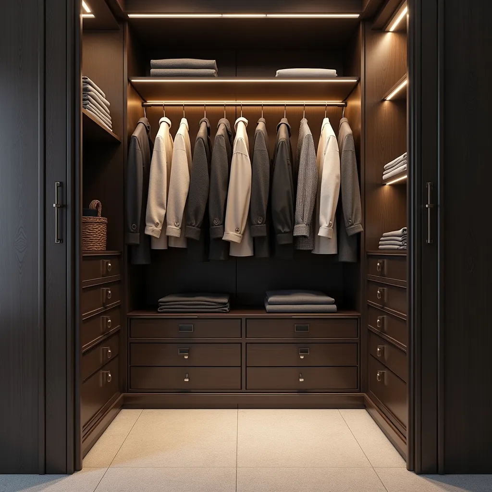
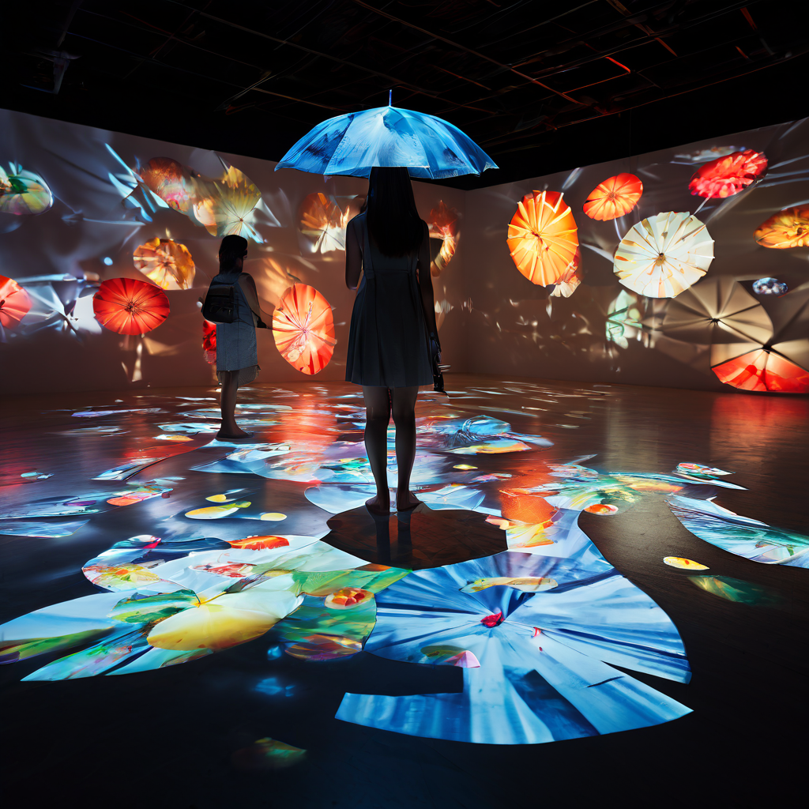
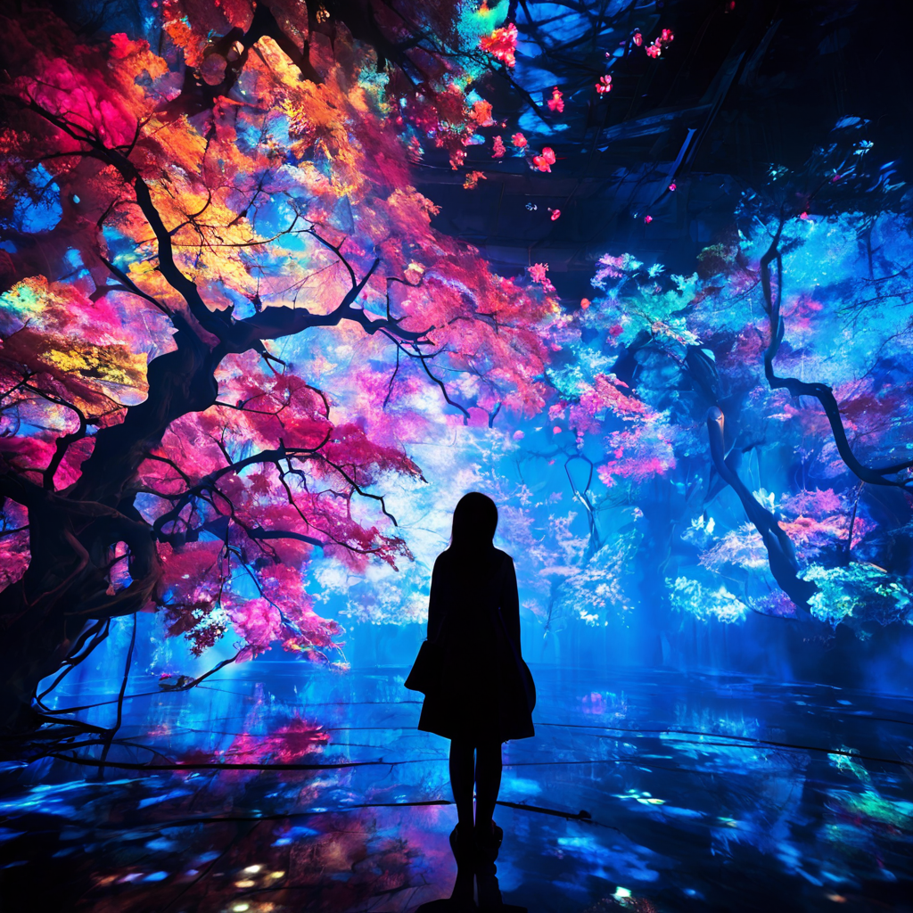

欢迎使用 **{小书匠}(xiaoshujiang)笔记软件**，您可以通过 `小书匠主按钮>模板` 里的模板管理来改变新建文章的内容。

----------

modern sample style,cinematic photo,a bath room with transparent bathtub and White wardrobe with glass and white blinds,white blinds,4k,highly detailed,night view,Linear light lighting,

a close up of a closet with a lot of clothes on shelves, elegant wardrobe, neat and tidy, exiting from a wardrobe, elegant futuristic wardrobe, small room, clean and organized, true realistic image, detailed clothes, fully space suited, clothes fully on, hyper-realistic, hyper - realistic, with photorealistic lighting, exquisite details, cupboards

concept collage map floor light projector mapping, beach umbrella pattern on the floor, light illunimate, referal teamlab exhibition, playful, in the style of photorealistic representation, naturalistic rendering, photorealistic details

Imagine a masterpiece artwork by the Japanese art collective teamLab, renowned for their fusion of technology, nature, and art. This digital creation features a vibrant and unique display of energy, each meticulously detailed and bursting with vivid colors. The scene is set in a magical, ethereal space that blurs the lines between the digital and natural worlds. Illuminated energy and leaves glow softly, creating an immersive, dream-like atmosphere. The composition showcases teamLab's signature style of blending traditional Japanese aesthetics with futuristic digital art, making it a true visual feast.

