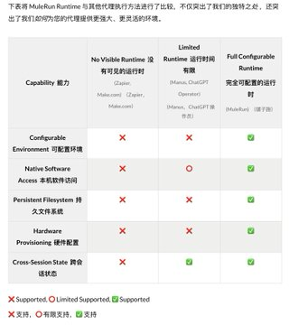

最近有个热度逐渐攀升的神秘项目 MuleRun，中文可以叫 骡子快跑？ 这是全球首个 Agent 市场，也是唯一一个能让 Agent 创作者赚钱的市场。 这个团队实力很强，野心很大，现在有很多基于 n8n 的 Agent，直接提供了一套环境，一键使用无须部署。未来也会支持 Dify、Claude Code 生产的 Agent。 技术上的突破： 终于有人去解决了 Manus 的临时沙箱问题，可配置环境、具备持久的文件系统 这种技术突破的结果就是，这个平台的 Agent 可以直接代肝手游，似乎是唯一能做到代肝手游日常任务的 Agent。

