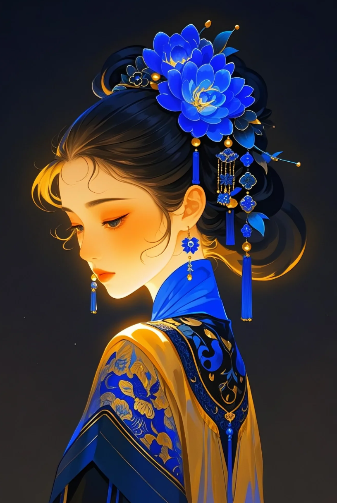
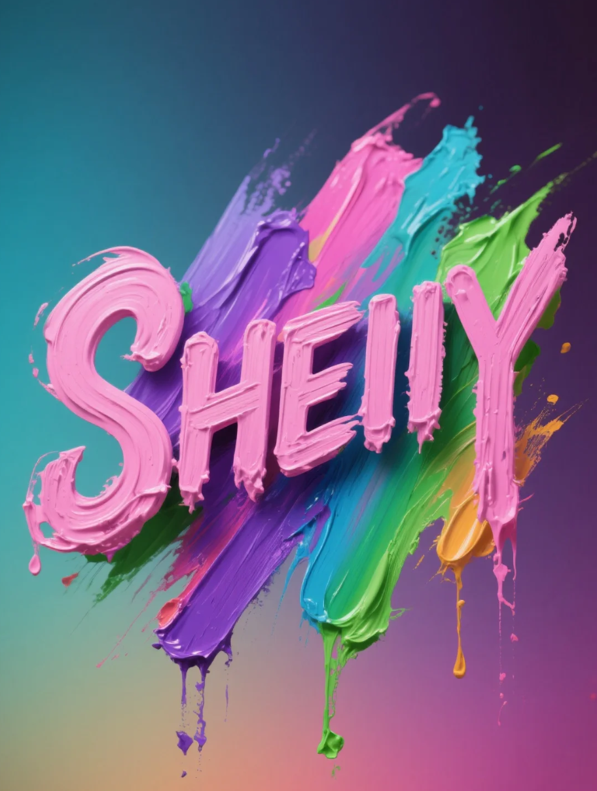

插画，中国国风美人，极简主义，超现实主义，国风，高级撞色，忧郁，氛围感，特写，人像是蓝色，带着蓝色的簪花，中式美学，蓝色混融着黑色，蓝色是黑暗中诞生的光，光感，氛围感

字体logo设计，"SHEIIY”，运用抽象表现主义以自由奔放的笔触和富有表现力的色彩运用为特点，色彩丰富且绚丽，运用了粉色、紫色、绿色、蓝色等多种色调，不同色彩相互交织碰撞，形成了强烈的视觉冲击，色彩之间的过渡自然又富有变化。 厚涂的技法使颜料具有明显的肌理感和立体感，颜料的堆积让画面呈现出一种浮雕般的效果。整体给人一种自由、随性且充满活力的感觉，具有很强的艺术感染力和视觉吸引力

hree的涂鸦字体、色彩绚丽，色彩使用高对比冷暖组合与霓虹色拼贴，整体视觉张力强