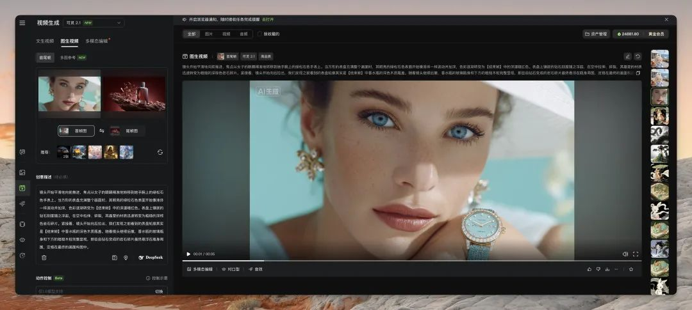

这套教程真正的价值不在这里，而在你接下来 10 分钟要做的两件事。 第一件事：把「流程」固化成「资产」 把今天所有步骤打包成一个模板：首帧图链接 | 尾帧图链接 | 差异分类（A/B）| 生成提示词 | 成片链接。以后任何新项目，直接往模板里填图，10 秒出提示词，半小时出片。这套模板可能就是你未来三个月的睡后生产力。 第二件事：把「特效」升维成「叙事」 首尾帧的本质不是「过渡」，而是「因果」。狐狸 → 巨龙：绸带化墨只是视觉钩子，真正的叙事是「妖狐渡劫化龙」。少女 → 盆景：树长人坐只是动态美感，真正的叙事是「人景共生」。当你用「因果」而不是「过渡」去写提示词，观众看到的就不是特效，而是故事。从「特效师」变成「叙事者」，你的视频单价至少翻 5 倍。

可灵今天更新了 2.1 的首尾帧视频模型 提示词理解和遵循能力大幅提升，即使好不相关的图片也可以实现自然过渡 可以看我做的这个视频的效果，所有分镜都是一次生成没有抽卡，就是素材拼接没有剪辑 我还打磨了一套提示词和工作流帮你降低抽卡频率提高生成质量


# 可灵 2.1 首尾帧藏师傅外挂教程：两张图→大片，附万能提示词

大家好，我是歸藏。

今天带来可灵 2.1 首尾帧模型的测试和使用教程，重点是教你解决首尾帧视频最难的两部分图片生成和提示词生成，尤其后面提示词价值很高，都能做产品了建议收藏。

前几天可灵给超级创作者开了 2.1 模型的首尾帧视频生成的权限，抽时间试了一下。

发现这个模型对于提示词理解和遵循以及图片转换的自然度都搞得太好了，基本上在首尾帧这个功能上已经到顶了。

知道有朋友习惯先质疑在质疑，先看结果。

所有分镜都是一次生成没有抽卡，就是素材拼接没有剪辑，只有简单变速。

是不是很好，而且这条视频我从头到尾基本只用了半小时就搞定了，等待视频生成的时候还能干别的。

这时候很多朋友就要说了：“就会骗我们，为啥我用的时候就得疯狂抽卡”。

我也反思了一下原因，在模型能力很强的情况下依然需要抽卡和没办法获得好素材的原因主要有两个：

首先是没办法获得合适的图片

虽然可灵 2.1 首尾帧已经强到了完全无关的两张图片也可以顺滑的转换，比如下面这个视频。但是肯定不像前后关联的图片带给观众的冲击强。


第二点就是有了图片之后不会写提示词

你获得了两张合适的图片，本能的意识到两者是有关联的，但是具体如何有美感和自然的从首帧变到尾帧自己是没有办法详细的描述的，所以就造成了你觉得变化的过程不符合自己的要求，只能通过不断抽卡祈祷出现奇迹。



所以今天藏师傅就教一下从获取合适的图片素材以及如何写提示词两方面生成优质的首尾帧视频，顺便看看可灵 2.1 的首尾帧模型有多强大。

## 如何获得合适的图片

首先我们来看一下如何获取用来做首尾帧视频生成的合适图片，我自己平时主要用三个方法：相同提示词抽卡、修改提示词抽卡、使用 FLUX Kontext 等图像编辑模型对图片进行编辑。

首先是相同提示词抽卡：

由于是相同提示词并且很多模型在同时生成多张的时候种子是一致的，所以多张图中很容易找到相似度很高的图片，非常适合用来做展示类的首尾帧视频。

比如我上面视频里面的每个角色展示的分镜就是相同提示词生成的，我找了两个面部和形体相似但是背景和服装不同的兔子来完成展示，可以看到可灵过渡的非常好，尤其是面部，给人感觉连贯性很强。

```
仿古画，版画，水墨，古风，笔触感，大师级构图，可爱俏皮的兔子精，白发发髻，神话，诡谲，奇幻，山海经，毛绒绒白色装饰，黑色背景，
```

' fill='%23FFFFFF'%3E%3Crect x='249' y='126' width='1' height='1'%3E%3C/rect%3E%3C/g%3E%3C/g%3E%3C/svg%3E)

修改提示词抽卡：

如果我们要做画面中主要人物或者物品的移动或者消失出现，一个合适的方法就是，先写出尾帧的提示词，生成图片后根据需求更改其中的一部分就行。

比如这个富士山和汽车的画面就是先有汽车停在富士山下的提示词，然后在删掉汽车的部分完成的。

```
首帧提示：mount fuji on the background centered,, professional color grading, 4k, shot on RED camera, wallpaper quality尾帧提示：two R34 nissan skylines, stunning, with mount fuji on the background centered,, professional color grading, 4k, shot on RED camera, wallpaper quality
```

' fill='%23FFFFFF'%3E%3Crect x='249' y='126' width='1' height='1'%3E%3C/rect%3E%3C/g%3E%3C/g%3E%3C/svg%3E)

使用图像编辑模型编辑：

以前想要编辑图片基本只能局部重绘，但是局部重绘局限性非常大，索性我们最近有了不少可用的图像编辑模型。

通过自然语言就可以编辑图片，这样我们就能实现对图片的精确控制，制作出各种特效。

比如将扁平的 Logo 图片变成有丰富材质和背景的视频，我就是拿了一张 Logo 图片然后用图片编辑模型让他加上材质更换背景。

最后在用可灵 2.1 首尾帧生成视频的时候可以看到从扁平到金属材质的过程可灵还加上了非常顺滑的过渡一点不突兀。

' fill='%23FFFFFF'%3E%3Crect x='249' y='126' width='1' height='1'%3E%3C/rect%3E%3C/g%3E%3C/g%3E%3C/svg%3E)

也可以让某个人物拿上东西或者放下东西，这个在电商场景非常实用。

比如下面这个就是用原始的模特图片和后面拿上产品的图片生成的，模特和产品都可以保持一致性，可用性相当高，而且可灵生成的时候完全没有常见的手部细节问题。

' fill='%23FFFFFF'%3E%3Crect x='249' y='126' width='1' height='1'%3E%3C/rect%3E%3C/g%3E%3C/g%3E%3C/svg%3E)

当然我们也可以用这个方式去做非常炫酷的文字特效。

比如我这里就先生成了一个金属文字的 KLING，然后用图像编辑模型修改文字，分别变成了 2.1 和 First Last Frame，然后用可灵 2.1 首尾帧能力生成两个视频，拼起来就是连贯的文字变化特效。

' fill='%23FFFFFF'%3E%3Crect x='249' y='126' width='1' height='1'%3E%3C/rect%3E%3C/g%3E%3C/g%3E%3C/svg%3E)

当然，我们也可以加上更加丰富的变化，比如每个分镜不止文字会变化文字材质和周围环境也发生变化，整个表现力会更加丰富，而且可灵 2.1 不止响应了文字本身的变化，环境的变化也跟文字是同步的。

' fill='%23FFFFFF'%3E%3Crect x='249' y='126' width='1' height='1'%3E%3C/rect%3E%3C/g%3E%3C/g%3E%3C/svg%3E)

图像编辑常见的人物或者玩偶变装特效也很好玩，比如这里让 Labubu 做个简单变装。

' fill='%23FFFFFF'%3E%3Crect x='249' y='126' width='1' height='1'%3E%3C/rect%3E%3C/g%3E%3C/g%3E%3C/svg%3E)

## 如何生成首尾帧视频的提示词

我上面所有的首尾帧的提示词没一个是我自己写的，完全是 AI 生成的。

先给大家用来生成首尾帧视频的提示词，然后教一下大家提示词为什么这么写。将你想要生成的首尾帧图片和这个提示词一起扔给任何一个头部的多模态模型就可以了。

这个提示词可以生效也是因为可灵 2.1 的首尾帧提示词理解和遵循能力大幅增强的缘故。

藏师傅的首尾帧提示词生成提示：

你是一位顶尖的创意视频导演和VFX（视觉特效）概念艺术家。你的任务是为AI视频生成模型设计一个从【起始帧】到【结束帧】的转场过程。

你的核心目标是：构思并用一段话清晰、具体地描述这个动态视觉变化。

在构思时，请遵循以下创作框架：

第一步：分析差异 快速判断【起始帧】和【结束帧】的差异程度。

A类 - 关联性强： 主体或场景基本一致，只是状态、风格或环境发生改变（例如，同一个人换了衣服，同一个场景从白天到黑夜）。

B类 - 差异巨大： 主体和场景完全不同（例如，一只猫在客厅 → 一艘飞船在太空）。

第二步：选择转场策略

如果属于 A类，优先采用“原地演变”的策略。让变化直接发生在主体和环境上，尽量不使用或只使用微弱的摄像机移动。

如果属于 B类，采用“运镜驱动转场”的策略。必须使用一种明确的摄像机移动（如推、拉、摇、移、旋转）来引导过渡，让镜头运动成为连接两个不相干画面的桥梁。

第三步：构思具体变化（从以下工具箱中选择组合）

主体变化： 主体如何改变？（形态变化、材质替换、服装更替、分解重组、消失或出现）。

环境变化： 背景如何改变？（时间流逝、季节更替、空间切换、从现实变为幻想）。

风格/特效变化： 用什么视觉风格或特效来包装这个过程？（例如，画面逐渐像素化后重组、被火焰/水流吞噬后显现、转变为水彩/油画风格、出现光效粒子）。

输出规则：

将你的最终构思整合为一个连贯的段落。

描述要具体、直接，充满画面感。专注于“我们看到了什么”，而不是“我们感觉到了什么”。

严格遵守你在第二步中选择的摄像机移动策略。

避免使用模糊的比喻和过于文学化的修辞。

现在，请根据我提供的【起始帧】（图片A）和【结束帧】（图片B），生成你的转场描述。

看下这个提示词有多强，他会自动判断两张图片的差异度，然后根据差异的不同采取不同的提示词生成策略。

需要注意的是这个提示词生成的视频提示需要模型有非常强的提示词理解和遵循能力，所以目前应该只有可灵 2.1 效果比较好。

比如这种两张图片有相关性的，他就会优先用原地演变的原则主要重点放在主体和环境身上，让人物穿衣服，背景的植物生长来完成首尾帧的转换。

```
画面开始时，少女俯身在地，随着她缓缓抬起上身，她身后的盆景松树也开始悄然生长，枝干以肉眼可见的速度变得更加粗壮和舒展，同时，少女裙摆和发髻上的孔雀羽饰也随之展开。当她完全坐直，将目光从地面移向前方时，背景的光线由柔和的漫射光转变为明亮的聚光，将她和生长后的松树轮廓勾勒得更为清晰，而她身旁原先独立的假山石已经和松树的根部融为一体，成为她坐下的石台。整个过程中，摄像机非常缓慢地向左平移，最终将人物与生长后的树木一同置于画面中心，完成了构图的变化。
```

' fill='%23FFFFFF'%3E%3Crect x='249' y='126' width='1' height='1'%3E%3C/rect%3E%3C/g%3E%3C/g%3E%3C/svg%3E)

如果两张图片差异巨大甚至完全无关怎么办，他就会要求模型加上运镜进行过渡，让连贯的镜头表现变成链接两张图片的桥梁，而且模型也会自己加上一些特效变化让一个具体的材质引导画面变化，一下就让两张图片有了联系。

比如这里的狐狸和龙差别很大，模型就让狐狸的绸带变为了流动的浓墨融合进了水墨的巨龙身体里面，一下就让两者有了关联，比如你就会想狐狸是不是就是巨龙的一个化身，而且我都没想到这个转场可灵 2.1 可以搞定。

```
镜头首先聚焦于狐妖腰间飘动的一条彩色绸带，随着一股无形的风起，这条绸带挣脱束缚，向画面深处和高处飞去。摄像机立即启动，以一个平滑的弧线运镜紧紧跟随这条绸带。在高速运动中，绸带的丝绸质感逐渐溶解，其上的多彩颜色开始褪去并融合成单一的、流动的浓墨。与此同时，背景中的亭台楼阁在动态模糊中被迅速替换为灰色的、翻涌的云海。当绸带完全转化为一道粗壮的墨迹时，它的表面开始浮现出细密的黑色鳞片纹理，并继续在云雾中延展、壮大，演化为龙的身体。镜头沿着这条由绸带演变而来的龙身继续向前推进并上摇，最终穿出云层，定格在【结束帧】中那颗巨大威严的龙头上，它的一对金瞳在阴沉的云海中赫然亮起。
```

' fill='%23FFFFFF'%3E%3Crect x='249' y='126' width='1' height='1'%3E%3C/rect%3E%3C/g%3E%3C/g%3E%3C/svg%3E)

这套提示词也不是 LLM 凭空产生的，而是我跟模型讨论的结果。

我先规定了一些基础的提示词生成原则，比如运镜不要太多，文学性修辞和比喻不要太多，产出了一个基础的要求。

然后就开始跟模型讨论两张图片变化的本质其实就是模型对“过程”和“变化”的理解与想象。

然后就开始遍历到底两张图片之间会有哪些变化和过程，遍历了一下发现确实是可以穷尽的，然后在对这么多状态进行分类和组合，最后得出了常见的变化和组合主体变化 + 环境变化或者风格变化 + 特效变化这两种。

结合结合这两者的特点和我前面的提示词书写要求，结合生成了最终的提示词，如果你以后想写自己的提示词也可以参考这个思路。


好了教程基本上已经写完了，我们来总结一下藏师傅这套可灵 2.1 首尾帧的通关攻略。

*   三张王牌拿图法（同提示词抽卡、改提示词抽卡、FLUX Kontext 编辑）
*   一条万能提示词，让多模态模型替你写提示词

但真正的价值不在这里，而在你接下来 10 分钟要做的两件事。

第一件事：把「流程」固化成「资产」

把今天所有步骤打包成一个模板：首帧图链接 | 尾帧图链接 | 差异分类（A/B）| 生成提示词 | 成片链接。以后任何新项目，直接往模板里填图，10 秒出提示词，半小时出片。这套模板可能就是你未来三个月的睡后生产力。

第二件事：把「特效」升维成「叙事」

首尾帧的本质不是「过渡」，而是「因果」。狐狸 → 巨龙：绸带化墨只是视觉钩子，真正的叙事是「妖狐渡劫化龙」。少女 → 盆景：树长人坐只是动态美感，真正的叙事是「人景共生」。当你用「因果」而不是「过渡」去写提示词，观众看到的就不是特效，而是故事。从「特效师」变成「叙事者」，你的视频单价至少翻 5 倍。

工具会迭代，模型会升级，但「流程资产化 + 叙事升维」这两件事永远不过时。现在，轮到你把「可灵 2.1 首尾帧」写进自己的复利曲线了。

最后如果觉得藏师傅这套方法对你有帮助的话，欢迎帮我点个赞👍或者喜欢🩷，也可以转发✈️需要的朋友。
