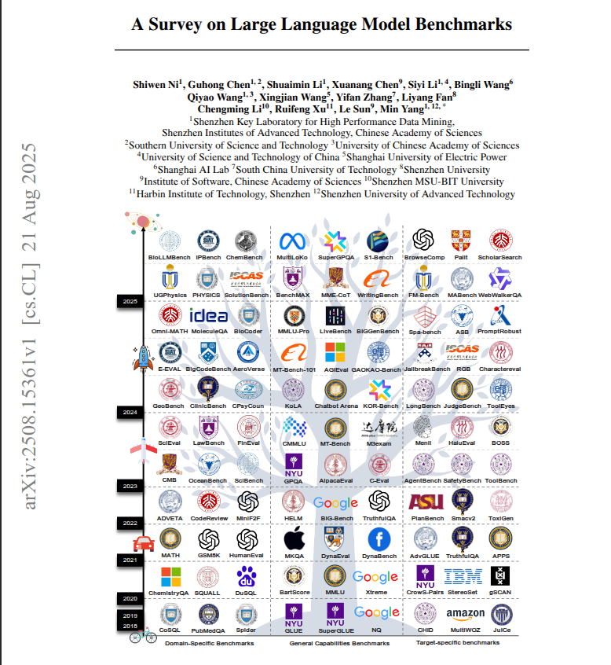

This survey maps the LLM benchmark landscape and shows where current tests fall short. 283 benchmarks, 3 categories: general, domain specific, target specific. The paper flags 3 traps that skew results. Training data leaks inflate scores. Culture and language bias tilt outcomes. Static, single turn grading misses the reasoning path and how models handle changing tasks. The conclusion is clear, evaluation should be dynamic, process aware, multi turn, and close to real workflows, with less focus on accuracy only. ---- Paper – arxiv. org/abs/2508.15361 Paper Title: "A Survey on LLM Benchmarks"
该调查绘制了 LLM 基准测试的格局，并显示了当前测试的不足之处。 283 个基准，3 个类别：通用、特定领域、特定目标。 该论文标记了 3 个扭曲结果的陷阱。 训练数据泄露会夸大分数。 文化和语言偏见倾斜结果。 静态的单轮评分错过了推理路径以及模型如何处理不断变化的任务。 结论很明确，评估应该是动态的、过程意识的、多轮的、接近真实的工作流程，而不是只关注准确性。 ---- 纸张 - 档案。org/abs/2508.15361 论文题目：“法学硕士基准调查”

