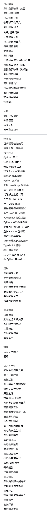

https://cloud.google.com/vertex-ai/generative-ai/docs/prompt-gallery/samples/write_and_generate_screenwriting

Generative AI prompt samples

bookmark_border
Choose a sample to view an example of a prompt and a response from one of Google's generative AI models. Alternatively, you can view and test prompts in the Google Cloud console if you have a Google Cloud account:

Go to Prompt gallery

For details on how to query a model with different parameter values and compare results, see one of the following topics based on your use case: image understanding, video understanding, audio understanding, or document understanding.

Use case: 
(Select use case)
Filter by keyword
Ad copy from video
Write / Generate: Write a creative ad copy based on a video.

Audio diarization
Classify: Segment an audio record by speaker labels.

Airline reviews
Write / Generate: The prompt asks the model to write a summary based on customer reviews of an airline company called GoWhereYouLike.

Advertising Campaign
Write / Generate: The AI is tasked to create advertising campaigns for its clients.

Culinary Dish Classification
Extract: Analyze popular Italian pasta by sorting them, identifying key ingredients, and presenting in a requested format.

User query assistance
Extract: This prompt uses website help center text to help users find answers to questions.

Audio Summarization
Summarize: Summarize an audio file

Video QA - exercise
Answer Question: Get the activity that's being performed in an exercise video by asking a question.

Audio summary on clean energy
Summarize: Summarize a piece of audio recording.

Chatbot recommendations for courses
Write / Generate: A chatbot suggests courses for a performing arts program.

Audio transcription
Extract: Generate the transcription for a piece of audio recording.

Audio/video Q&A
Answer Question: Audio/video Q&A

Hashtags for a video
Summarize: Generate hashtags for a video ad

Blog post creator
Write / Generate: Create a blog post

Classify headlines
Classify: Label news headlines with custom topics using examples.

Beach vacation
Write / Generate: The prompt asks the model to write a summary based on customer reviews of a beach in California.

Book Publishing and Editing
Write / Generate: Take a verbose, subjective excerpt and distill it into a concise, objective list of facts

Animal Information Chatbot
Write / Generate: The animal assistant chatbot answers questions about animals.

Business Development Writing
Write / Generate: Extract relevant information from the user input that can be used in business development initiatives.

Venue Selection Database Tool
Write / Generate: Take information about a touring band and find the best venues for the group from a database of venues.

Code optimization explanation
Code: Optimize and explain C++ code, focusing on time complexity.

Optimize uniqueness check
Code: Optimize the generation of unique identifiers.

Predicting revenue
Code: Train and evaluate a Random Forest model using sales data.

Company Financial Analysis
Answer Question: Company Financial Analysis

Company chatbot
Answer Question: Create a chatbot for customers with basic company information.

Describe video content
Write / Generate: Get a description of the contents of a rock climbing video.

Completing Go functions
Code: Generate SQL scripts based on a CSV file using Go

Document comparison
Summarize: Compare the contents of 2 documents

Customer Service Assistance
Answer Question: The prompt works to extract the main issues out from customer service complaints and suggest ways to resolve them.

Novel Writing Assistance
Write / Generate: Generate a scene for a book a writer is writing in order to help the writer get through writer's block.

Data sources and monitoring
Code: Specify different training data and add monitoring.

Debug nullptr error
Code: Debug C++ code with explanations.

Describe Python code
Code: Provide a detailed description of Python timer code.

Django form debugging
Code: Evaluating Django form-handling code to identify bugs, inefficiencies, and security issues.

Python algorithm
Code: Generate codes for algorithm using context clues.

Explain JavaScript code
Code: Walking through Javascript code block

Extract entities from an invoice
Extract: Extract entities from an invoice document and return them in JSON.

Document question answering
Answer Question: Answer question(s) over a document.

E-commerce Business Report
Write / Generate: Analyze the product information provided to generate a report based on the category or categories input by the user.

Video Q&A
Answer Question: Answer questions about the key moments in the video.

Legal QA - Extractive
Answer Question: Ask extractive questions about a (long) legal document.

French text sample
Transform: French text sample

Educational content generator
Write / Generate: This model is helping teachers with generating topics, open-ended and closed-ended multiple choice questions.

Product Advertisement Ideas
Write / Generate: Decide on the best advertising method for the user-input product/company

Speech Writing
Write / Generate: A speech must be written adhering to the information input by the user.

Educational Lesson Planning
Write / Generate: The prompt creates an engaging and grade level appropriate lesson plan for teachers.

European Travel Itinerary
Write / Generate: The prompt guides the model to create a European travel itinerary with requests from the user.

Extract text from images
Extract: Transcribe text from a handwritten note.

Extract video chapters
Extract: Extract the chapters in a video as structured JSON

Fill an empty form
Write / Generate: Automatically fill a form field in a target form from a source document.

Financial QA - Extractive
Answer Question: Ask extractive questions about a (long) financial document.

Financial QA - Deductive
Answer Question: Ask deductive questions about a (long) financial document.

Generate C++ test cases
Code: Validate the behavior of a C++ class using varied assertions

Generate code from comments
Code: Generate Java code from natural-language comments

Generate Go commit message
Code: Create a conventional commit message for Golang changes.

Generate Java classes
Code: Create an interface and class implementation in Java.

Generate search tree tests
Code: Create unit tests with edge cases for binary search trees

Generate Java unit tests
Code: Generate unit tests for legacy Java code

Image question answering
Answer Question: Show the model an image of a fruit and find the price from another image.

JavaScript physics simulation
Code: Modifying and explaining a JavaScript marble simulation.

Marketing content generator
Write / Generate: This prompt generates an article promoting a brand using a famous person and a pet.

Nonprofit Media Assistance
Answer Question: A media relations bot provides talking points extracted from a year-end report.

Interview Prep QA
Answer Question: This model helps prepare interviewers for various different interviews.

Organize viewpoints and examples
Extract: Extract main viewpoints and examples into a table, given the provided template and user input.

Python/ data science explanation
Code: Describe how Python code retrieves and visualizes data.

Pet/animal needs
Write / Generate: Help pet owners with their pets

Procedural to OOP refactoring
Code: Convert procedural code to an object-oriented design

Vacation Planning
Write / Generate: The model's goal is helping a client plan a family vacation.

Question answering about a chart
Answer Question: Answer questions by analyzing a simple line chart.

Question answering about an image
Answer Question: Answer knowledge-extensive questions about an image

Refactoring Python code
Code: Refactor Python code for better modularity and add functionality.

Learn about dataset transformations
Code: Understand preprocessing, balancing, stratification, and dataset suitability for machine learning.

Regex completion and explanation
Code: Implement regex-based sentence splitting for function completion.

Scene Improvement for Scriptwriting
Write / Generate: The model acts as a chatbot that helps improve scripts for television and film.

Screenwriting
Write / Generate: The prompt instructs the model to outline a movie plot and generate character ideas.

TypeScript migration
Code: Translate JavaScript to TypeScript.

Translation
Transform: Translate an audio file

Video Ad script writer
Write / Generate: Write social media style video ad scripts

Sentiment analysis
Classify: Assign a positive or negative sentiment to text.

Skin care questions
Answer Question: Use only the provided sources to answer questions without citations.

Rules' Effect on Profits
Write / Generate: Generate content for a section of a college sports management textbook.

Summarization of reviews
Write / Generate: Summarize reviews to understand pros and cons of businesses and provide relevant advice.

SQL query explanation
Code: Explain the components of two SQL queries, compare outputs, and assess efficiency.

Summarize video
Summarize: Summarize a video and extract important dialogue.

Swimming Q&A
Answer Question: Questions & answers about learning swimming.

Translate C++ to Java
Code: Convert C++ code to Java while preserving functionality

Vocabulary Quiz Administrating Bot
Write / Generate: Generate quizzes about vocabulary words.

Travel tips
Write / Generate: The user wants the model to help a new traveler with travel tips for traveling.

Title generation
Summarize: Create a title for an article using examples.

Teaching Python decorators
Code: Identify and explain the decorators in code.

Writing Critique
Write / Generate: Help improve the quality of a presentation.

Writing Assistant
Write / Generate: Help turn a document into an engaging presentation.

Video game categories
Classify: This is a multi-use prompt for generating terms and definitions and then placing them into categories.

