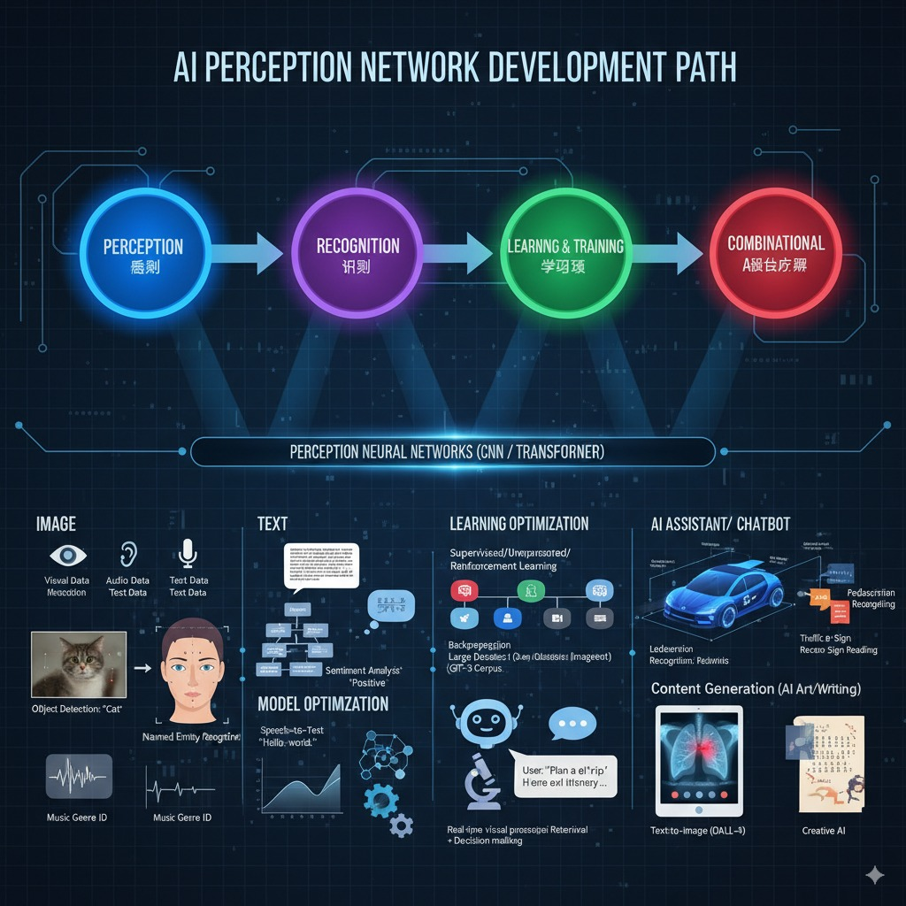
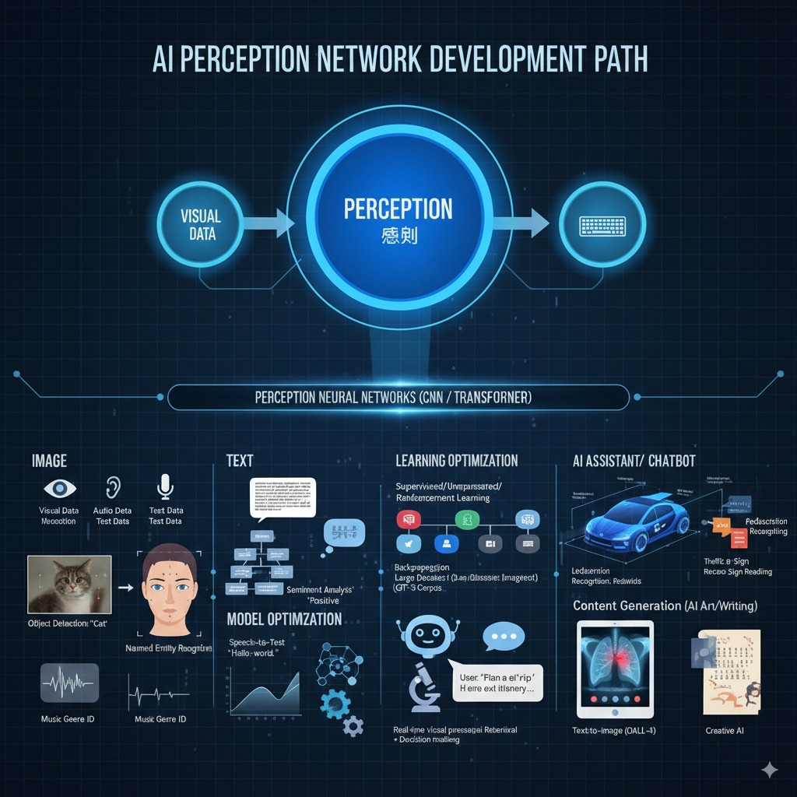

ser

请帮我画一张图表示目前AI视觉和LLM方面的进展主要都是感知神经网络的功能，即能感知即可识别，能识别即可学习训练，可学习训练即可组合应用....我只是提供前面的思路，请你细化下整体的结构，用尽可能多和详细的图列出相应的例子

Model

这是一个很好的思路，我们可以通过一张图来展示AI视觉和LLM的发展，以及它们如何从感知到应用。我将把这个概念拆解成几个部分来详细说明，并用图例来展示。

首先，我们来创建一个整体的概念图，描绘AI视觉和LLM从“感知”到“识别”到“学习训练”再到“组合应用”的流程。

整体概念图：AI感知神经网络的发展路径

感知神经网络（无论是CNN在视觉领域还是Transformer在LLM领域）是核心。

以下是对图中每个阶段的详细解释和具体例子。

* * *

### 第一阶段：感知 (Perception)

核心思想： AI通过传感器（如摄像头、麦克风）或输入数据（文本）获取原始信息，将其转化为机器可以理解的数字信号。这是所有后续步骤的基础。感知神经网络（Convolutional Neural Networks for vision, Transformers for LLM）在此阶段负责提取低级特征。

图示：

