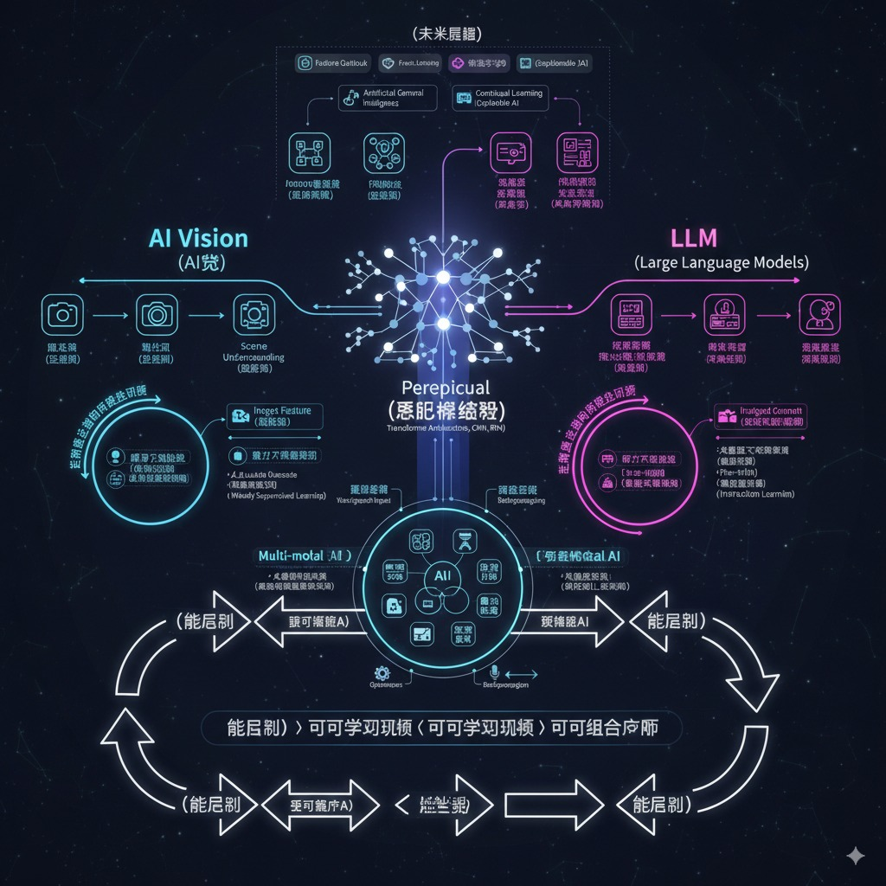

这幅图将展示AI视觉和LLM领域的核心进展，并突出“感知-识别-学习-应用”的循环。

核心思想：

*   感知神经网络是基石： 无论是视觉还是语言，当前的AI系统都依赖于强大的感知神经网络来理解输入。

*   感知即识别： 一旦能够有效感知（例如，看到图像中的物体，听到语言中的词汇），系统就能对其进行识别和分类。

*   识别即学习训练： 识别能力是通过大量数据和学习训练获得的，模型不断优化其对模式的识别能力。

*   学习训练即组合应用： 经过训练的模型可以被组合和应用到各种复杂的任务中，无论是生成图像、回答问题、进行推理还是控制机器人。

图的整体结构：

1.  中心主干（感知神经网络）：

    *   在图的中心，放置一个大型、抽象的神经网络结构，可以表示为相互连接的节点和层。

    *   在神经网络的内部或上方，写上“感知神经网络 (Perceptual Neural Networks)”，作为核心概念。

2.  左侧分支（AI视觉）：

    *   从感知神经网络的左侧引出一个分支，标题为“AI视觉 (AI Vision)”。

    *   输入： 在分支的起点，放置一个“图像/视频输入”的图标（例如，一个相机或屏幕）。

    *   感知： 图像和视频流向神经网络，旁边标注“图像特征感知 (Image Feature Perception)”。

    *   识别： 从神经网络的输出端，引出“物体识别 (Object Recognition)”、“场景理解 (Scene Understanding)”、“图像分类 (Image Classification)”的图标或文字。

    *   学习训练： 在识别和神经网络之间，可以有一个循环箭头，表示“视觉模型训练 (Vision Model Training)”，旁边可以有“大量标注数据 (Large Labeled Datasets)”。

    *   应用： 从识别部分引出，展示一些应用场景的图标或小图，例如：“自动驾驶 (Autonomous Driving)”、“医疗影像分析 (Medical Image Analysis)”、“人脸识别 (Face Recognition)”。

3.  右侧分支（LLM - 大语言模型）：

    *   从感知神经网络的右侧引出一个分支，标题为“LLM (Large Language Models)”。

    *   输入： 在分支的起点，放置一个“文本/语音输入”的图标（例如，键盘或麦克风）。

    *   感知： 文本和语音流向神经网络，旁边标注“语言模式感知 (Language Pattern Perception)”。

    *   识别： 从神经网络的输出端，引出“词义理解 (Word Semantics Understanding)”、“语法结构识别 (Grammar Structure Recognition)”、“情感分析 (Sentiment Analysis)”的图标或文字。

    *   学习训练： 在识别和神经网络之间，可以有一个循环箭头，表示“语言模型训练 (Language Model Training)”，旁边可以有“海量文本语料 (Massive Text Corpora)”。

    *   应用： 从识别部分引出，展示一些应用场景的图标或小图，例如：“智能对话 (Intelligent Conversation)”、“文本生成 (Text Generation)”、“代码辅助 (Code Assistance)”、“机器翻译 (Machine Translation)”。

4.  循环箭头（感知-识别-学习-应用）：

    *   在整个图的底部，或者作为一个贯穿两侧分支的循环，用箭头和文字清晰地标明：

        *   “能感知 (Perceive)” -> “即可识别 (Identify)”

        *   “能识别 (Identify)” -> “即可学习训练 (Learn & Train)”

        *   “可学习训练 (Learn & Train)” -> “即可组合应用 (Combine & Apply)”

5.  这个循环箭头可以是双向的，表示应用反馈可以进一步优化感知和学习。

6.  图示风格：

    *   可以采用现代、简洁的扁平化设计，或者科技感十足的霓虹线条风格。

    *   使用不同的颜色区分AI视觉和LLM的部分，但感知神经网络保持中性色调。

    *   箭头要清晰，指示信息流和逻辑关系。

文字标注（图中可以包含的简要说明）：

*   感知神经网络: 高度抽象特征提取器，处理原始输入数据。

*   AI视觉: 从像素到语义的理解。

*   LLM: 从字符到意义的深层洞察。

*   训练数据: 大规模、多样化的数据集是学习的基础。

*   组合应用: 多模态、跨领域集成，解决复杂现实问题。

这张图将直观地展示AI视觉和LLM如何以感知神经网络为核心，通过“感知-识别-学习-应用”的循环，不断发展并应用于各种领域。

现在，请看这张图来表示这个概念：

An internal error has occurred.

