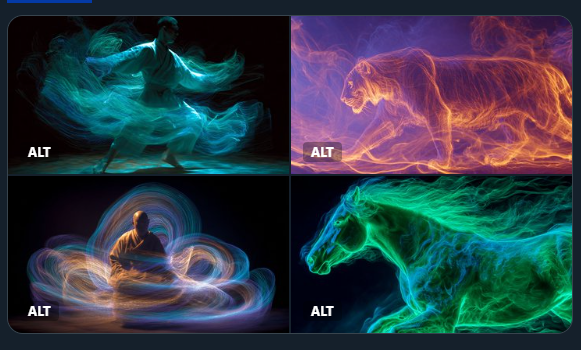

Prompt : A Kinetic Aura Spectrography of [SUBJECT], capturing the energy field and motion of living beings. Utilize swirling trails of [COLOR1] and [COLOR2] light to represent different aspects of the aura and its movement Check ALTS
