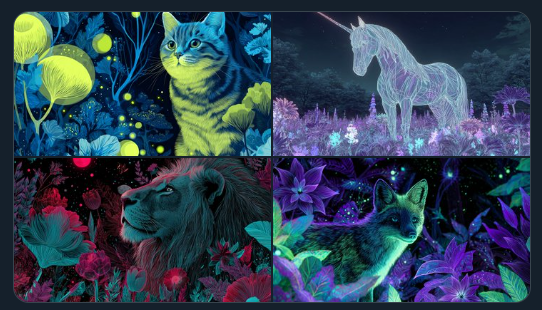

LudovicCreator@LudovicCreator·12h NEON GLOW CELESTIAL GARDEN  Prompt : [SUBJECT] illustrated in a Neon Glow Celestial Garden, with glowing flowers and celestial bodies. Highlight the ethereal beauty of the garden using bright [COLOR1] and [COLOR2] Check ALTS
 霓虹灯天国花园  提示： [主题]在霓虹灯天国花园中插图，有发光的花朵和天体。使用明亮的 [COLOR1] 和 [COLOR2] 突出花园的空灵之美 检查 ALTS

