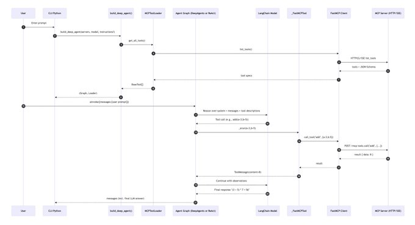

不用写工具，MCP服务器里现抓现用的通用AI智能体框架：DeepMCPAgent 它通过MCP来动态发现和调用外部工具，然后规划、调用，无需编程 与LangChain和LangGraph无缝集成，兼容主流LLM 它提供两种智能体逻辑，默认回退到LangGraph-ReAct；额外安装DeepAgents，即可启用高级模式，可处理多步骤、长链条的复杂任务 好处是极易扩展，可以随时增加、删除或更新工具，完全不需要修改主程序 [#MCP](https://x.com/hashtag/MCP?src=hashtag_click) [#AIagent](https://x.com/hashtag/AIagent?src=hashtag_click) [#DeepMCPAgent](https://x.com/hashtag/DeepMCPAgent?src=hashtag_click)

