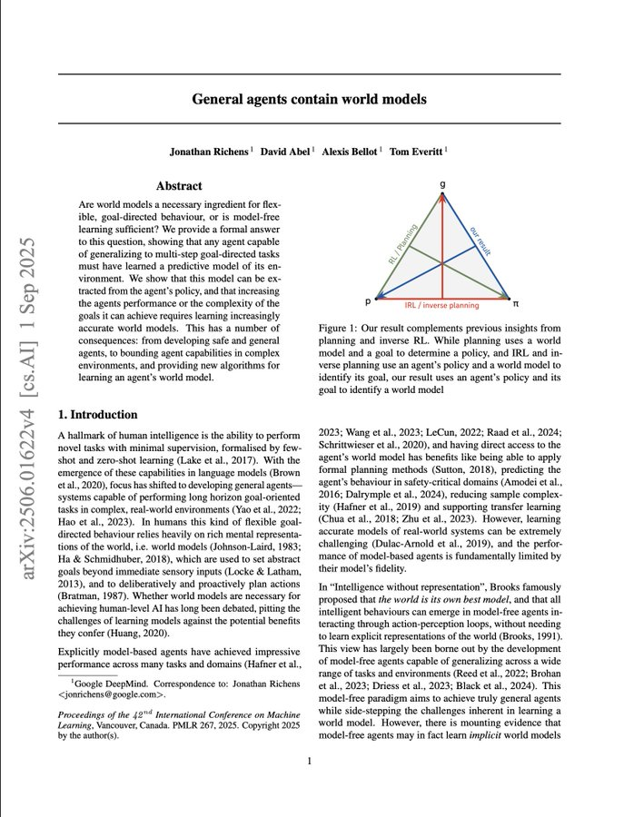

转译：一篇新的名为《通用智能体包含世界模型》（General agents contain world models）的论文论文给出了严格的数学证明：智能体想要变得聪明，就必须建立一个关于其所处世界的模型——无论我们是否在程序里这样要求它。

这证明，我们长期以来梦想的那条通往通用人工智能的“无模型”之路，可能从一开始就想反了。

多年来，人工智能领域一直存在一个巨大的争论：我们是需要为 AI 智能体 明确构建“世界模型”（就像在脑海里对环境进行模拟推演），还是说，智能可以从简单的试错中自发涌现（即“无模型”方法）？

“无模型” (model-free) 的想法一度非常吸引人，因为对真实世界进行建模实在是太难了。然而，这项新发现告诉我们，这份苦差事，谁也躲不掉。

核心发现：强大的智能体必然自带世界模型

General agents contain world models 这篇名论文，其核心发现是一个严谨的数学证明。

它指出：任何一个能够以有限的失败率完成复杂、多步骤任务的智能体，都必然在内部学习到了一个精确的环境预测模型。

简单来说就是：如果一个 AI 擅长做长远规划，那么它的行为本身，就已经包含了模拟其世界所需要的全部信息。

它表现得越好（犯错越少），或者它能处理的任务链条越长（目标深度越深），它内部的世界模型就必须越精确。

“隐藏款”能力：世界模型是涌现出来的

这件事最有趣的地方在于，这个世界模型是一种隐藏的能力。

它不是你必须明确写进代码里的东西，而是 AI 为了获得通用能力，在训练过程中不得不产生的副产品。为了高效地完成任务，智能体被“逼上梁山”，不得不去学习世界运转的规律。

那么，研究人员是如何证明这一点的呢？方法出奇地简单。

他们设计了一种算法，通过给智能体提出“二选一”的复杂目标来“审问”它。智能体的每一次抉择，都暴露了它对“哪条路更可能成功”的内在预测。通过这种方式，研究人员就能反向推导出它内部模型中的概率。

这对我们意味着什么？

这个发现彻底改变了我对“黑箱”AI 的看法。那种想通过“无模型捷径”直达通用人工智能 (AGI) 的想法，现在看来是行不通了。世界建模这项艰苦的工作无法避免，它只是以一种不易察觉的方式，在神经网络内部悄然发生了。

最实际的影响是什么？安全与可解释性 (interpretability)。

这篇论文从理论上保证了，我们能从任何一个足够强大的智能体中提取出这个隐藏的世界模型，而方法仅仅是观察它的行为策略。这意味着，我们可以打开一个不透明的系统，拿出它的世界“蓝图”来进行审查。

从更宏观的视角看，这项研究可能会统一整个领域。与其再争论“基于模型 vs. 无模型”路线，未来的焦点可以转移到如何构建、提取和利用这些必然存在的世界模型上。

它也为我们在大语言模型 (LLM) 中观察到的“涌现能力” (emergent capabilities) 提供了一个严谨的解释。

同时，它也引出了一系列新问题：

• 今天这些基础模型内部隐含的世界模型究竟长什么样？
• 它们的精确度有多高？
• 我们能否利用这种提取方法来调试它们，从而在有害行为发生前就及时阻止？
探索才刚刚开始。

说到底，这篇论文为一个古老的想法提供了数学上的定论：一个智能体不仅仅是拥有一个世界模型——从某种意义上说，它本身就是一个模型。

这不再仅仅是一个架构上的选择，它看起来更像是通用智能的一条基本定律。

智能体必须在现实世界占据能量—信息—行动的位置，才能产生意义与价值。 离开物理环境，算法只是符号堆砌；感知-行动闭环是智能的最低要求；评估标准必须是现实世界的任务绩效。