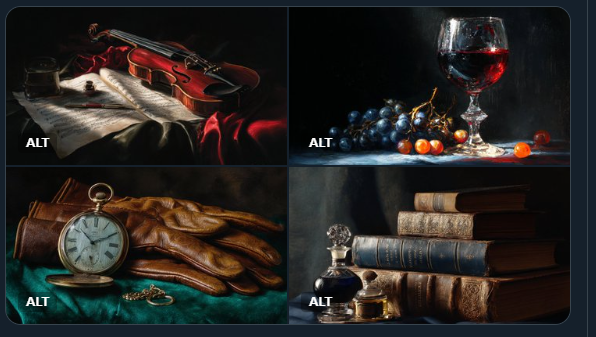

A Chiaroscuro Still Life featuring [SUBJECT]. Emphasize the dramatic interplay of light and shadow, using deep blacks and brilliant highlights. Subtle touches of [COLOR1] and [COLOR2] appear in the dimly lit areas. Check ALTS

A Chiaroscuro Still Life featuring a pocket watch and leather gloves. Emphasize the dramatic interplay of light and shadow, using deep blacks and brilliant highlights. Subtle touches of bronze and forest green appear in the dimly lit areas --ar 3:2 --v 7.0
A Chiaroscuro Still Life featuring a glass of red wine and scattered grapes. Emphasize the dramatic interplay of light and shadow, using deep blacks and brilliant highlights. Subtle touches of amber orange and midnight blue appear in the dimly lit areas --ar 3:2 --v 7.0

A Chiaroscuro Still Life featuring a violin resting on sheet music. Emphasize the dramatic interplay of light and shadow, using deep blacks and brilliant highlights. Subtle touches of crimson red and olive green appear in the dimly lit areas --ar 3:2 --v 7.0