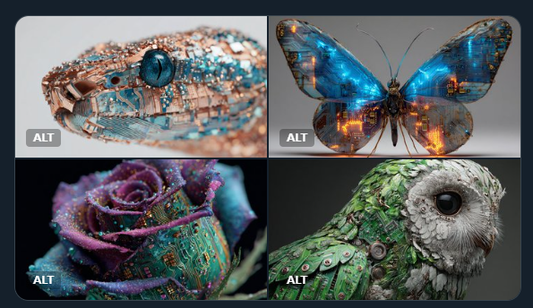
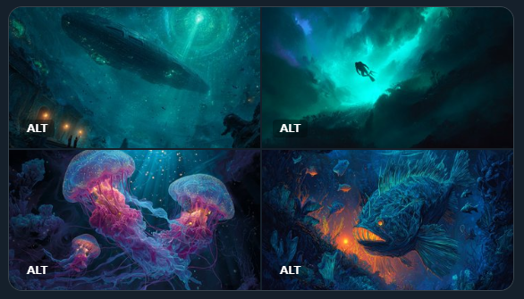

Prompt : A Cyberorganic Hybridization of [SUBJECT], where technology and nature merge in a fusion of infrared-lit circuitry and organic matter. Employ a palette of bold [COLOR1] and [COLOR2] to emphasize the contrast between the two

A Cyberorganic Hybridization of a butterfly, where technology and nature merge in a fusion of infrared-lit circuitry and organic matter. Employ a palette of bold electric blue and neon orange to emphasize the contrast between the two --ar 3:2 --v 7.0

A Cyberorganic Hybridization of a rose, where technology and nature merge in a fusion of infrared-lit circuitry and organic matter. Employ a palette of bold violet and chartreuse to emphasize the contrast between the two --ar 3:2 --v 7.0

A school of jellyfish descending into a Bioluminescent Abyss, with glowing marine life and eerie, underwater landscapes. Utilize a palette of deep blues and greens, featuring glowing magenta and shimmering gold, to create an otherworldly atmosphere

Prompt : [SUBJECT] descending into a Bioluminescent Abyss, with glowing marine life and eerie, underwater landscapes. Utilize a palette of deep blues and greens, featuring [COLOR1] and [COLOR2], to create an otherworldly atmosphere Check ALTS
 生物发光深渊  迅速的 ： [主题] 深入生物发光深渊，感受闪耀的海洋生物和怪诞的水下景观。运用深蓝色和绿色的配色方案，以 [颜色1] 和 [颜色2] 为特色，营造出一种超凡脱俗的氛围。
