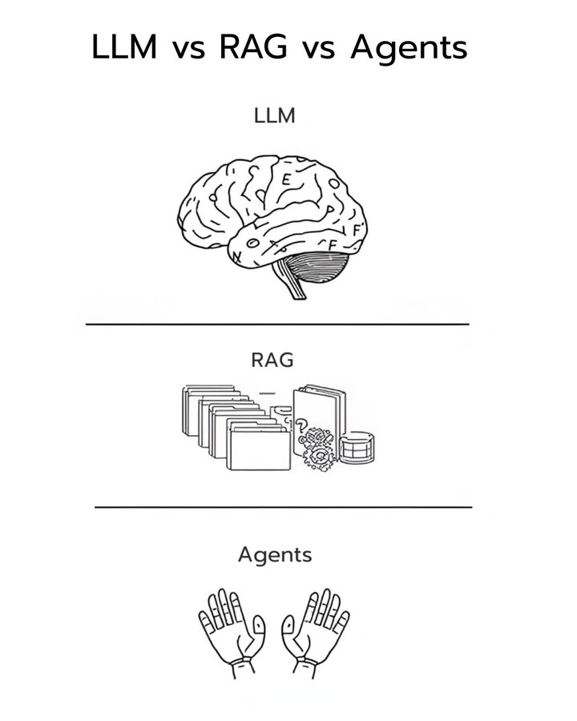

I finally understand the difference between LLMs, RAG, and AI Agents.
我终于明白了 LLM、RAG 和 AI 代理之间的区别。

After building production AI systems for 2 years...
在构建生产级人工智能系统两年后……

Here's what actually matters:
真正重要的是：

They're not competing technologies. They're three layers of the same intelligence stack, and most people are using them completely wrong.
它们并非相互竞争的技术，而是同一智能堆栈的三层结构，而大多数人对它们的使用都完全错误。

> The LLM is the brain <
法学硕士就是大脑

It can reason, write, and understand language. But here's the catch: it's frozen in time. GPT-4 knows nothing past its training cutoff. Ask it about yesterday's news? Hallucination city.
它可以推理、写作和理解语言。但问题在于：它的时间观念被冻结了。GPT-4 对训练阶段之后的事情一无所知。问它昨天的新闻？它只会胡言乱语。

LLMs are brilliant at thinking but blind to the present.
法学硕士们思维敏捷，但对现实却视而不见。

> RAG is the memory system <
RAG 是记忆系统

It connects that frozen brain to live knowledge. When you ask a question, RAG searches external databases, pulls relevant documents, and feeds them to the LLM as context.
它将静止的大脑与鲜活的知识连接起来。当你提出问题时，RAG 会搜索外部数据库，提取相关文档，并将其作为上下文信息提供给 LLM。

Suddenly your static model becomes dynamic. Fresh data. Real facts. Zero retraining needed.
突然间，你的静态模型变成了动态模型。全新的数据，真实的事实，无需重新训练。

The accuracy gains are immediate. Instead of guessing from training data, the model reasons over actual retrieved information. You can audit exactly which documents influenced each answer.
准确率的提升立竿见影。模型不再依赖训练数据进行猜测，而是根据实际检索到的信息进行推理。您可以精确地审核哪些文档影响了每个答案。

> AI Agents are the decision-makers <
人工智能代理是决策者。

While LLMs think and RAG informs, neither can act. Agents wrap a control loop around the brain. They perceive goals, plan steps, execute actions, and reflect on results.
虽然逻辑逻辑模型（LLM）能够思考，红黄绿系统（RAG）能够提供信息，但两者都无法行动。智能体则围绕大脑构建控制回路。它们感知目标、规划步骤、执行行动并反思结果。

An Agent doesn't just answer questions. It researches topics, pulls data, synthesizes reports, and sends emails. All autonomous.
智能体不只是回答问题，它还会研究主题、提取数据、生成报告并发送电子邮件。所有这些都是自主完成的。

Here's where it gets interesting.
接下来就精彩了。

Most AI demos are just LLMs with fancy prompting. Real production systems layer all three: the LLM for reasoning, RAG for accuracy, and the Agent framework for autonomy.
大多数人工智能演示只是带有花哨提示的逻辑推理模型（LLM）。真正的生产系统会将这三者结合起来：LLM 用于推理，RAG 用于准确率，Agent 框架用于自主性。

Use an LLM alone when you need pure language tasks: writing, summarizing, explaining.
当您需要纯粹的语言任务时，例如写作、总结、解释，请单独使用语言学习软件 (LLM)。

Add RAG when accuracy matters: answering from internal docs, technical manuals, domain-specific knowledge.
当准确性至关重要时，请添加 RAG（红、灰、绿）标记：答案来自内部文档、技术手册、特定领域知识。

Deploy Agents when you need real autonomy: systems that decide, act, and manage complex workflows.
当您需要真正的自主性时，请部署代理：能够做出决策、采取行动和管理复杂工作流程的系统。

The future isn't about choosing one. It's about architecting all three together.
未来并非在于选择其中之一，而在于将这三者融合起来。

LLMs for thinking. RAG for knowing. Agents for doing.
思考型法学硕士。知识型学士。行动型人才。

That's the actual intelligence stack.
这就是实际的智能堆栈。

