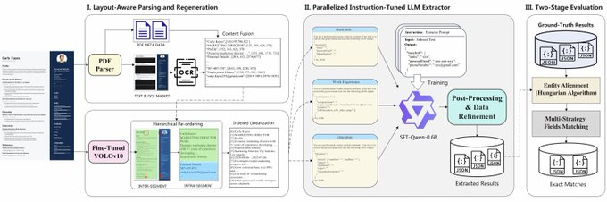

阿里刚刚发了一个智能简历解析系统：SmartResume，直接把PDF/图片/Office文档简历变成结构化数据

HR部门的手动录入工作可以直接秒级完成了

系统融合了OCR与PDF元数据完成文本提取，结合版面检测重建阅读顺序，通过LLM将内容转换为结构化字段

能够提取基本信息、工作经历、教育背景等结构化信息

模型用的微调版Qwen3-0.6B，版面检测模型用的YOLOv10

可API及本地模型部署

