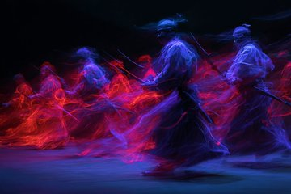
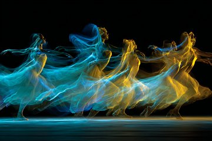
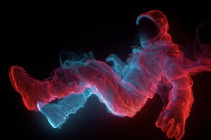

LudovicCreator@LudovicCreator·22hTL DANCE IN ZERO GRAVITY  Prompt : A Light Trails Dance in Zero Gravity of [SUBJECT], where figures move gracefully, leaving luminous trails that defy the constraints of gravity. The colors [COLOR1] and [COLOR2] should emphasize the fluidity and weightlessness of the scene Check ALTS
 零重力舞蹈  迅速的 ： 在[主题]的零重力环境下，光迹翩翩起舞，人物优雅地移动，留下光迹，仿佛摆脱了重力的束缚。[颜色1]和[颜色2]应强调场景的流动性和轻盈感。 检查 ALTS

A Light Trails Dance in Zero Gravity of samurai warriors, where figures move gracefully, leaving luminous trails that defy the constraints of gravity. The colors deep indigo and fiery red should emphasize the fluidity and weightlessness of the scene --ar 3:2 --v 7.0
武士在零重力中翩翩起舞，光影轨迹交错，舞者身姿优雅，拖曳出的光芒仿佛挣脱了重力的束缚。深靛蓝与火红的运用，更突显了画面的流动与轻盈之感。——ar 3:2——v 7.0

A Light Trails Dance in Zero Gravity of jellyfish, where figures move gracefully, leaving luminous trails that defy the constraints of gravity. The colors neon violet and emerald green should emphasize the fluidity and weightlessness of the scene --ar 3:2 --v 7.0
水母在零重力下翩翩起舞，光影交错，舞者身姿轻盈，留下闪耀的光迹，仿佛挣脱了重力的束缚。霓虹紫和翠绿的运用，更突显了画面的流动性和轻盈感。——ar 3:2——v 7.0

A Light Trails Dance in Zero Gravity of ballet dancers, where figures move gracefully, leaving luminous trails that defy the constraints of gravity. The colors azure blue and golden yellow should emphasize the fluidity and weightlessness of the scene --ar 3:2 --v 7.0
芭蕾舞者在零重力下翩翩起舞，光影交错，舞姿优雅，留下光迹，仿佛摆脱了重力的束缚。天蓝色和金黄色的运用，旨在强调画面的流畅性和轻盈感。——ar 3:2——v 7.0

A Light Trails Dance in Zero Gravity of an astronaut, where figures move gracefully, leaving luminous trails that defy the constraints of gravity. The colors crimson red and electric blue should emphasize the fluidity and weightlessness of the scene --ar 3:2 --v 7.0
宇航员在零重力环境下翩翩起舞，光迹优美，人物动作轻盈，留下光迹，仿佛摆脱了重力的束缚。深红色和电光蓝的运用，旨在强调画面的流畅性和失重感。——ar 3:2——v 7.0
