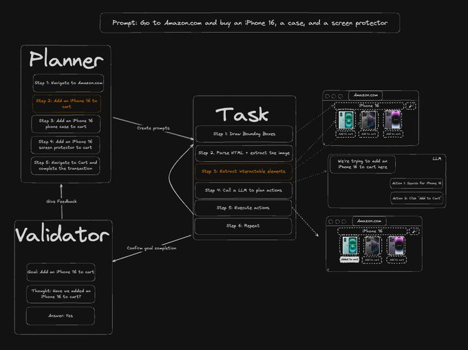

以前实现网页自动化，依赖 DOM 解析和 XPath 方式，最怕的就是网页改版，所有元素改版又得重新调试修改代码。

现在可以试下，Skyvern 这款开源的浏览器自动化工具，通过视觉 AI 大模型来识别与理解网页内容。

即使网站布局发生了改变，也能最大程度保证工作，支持模拟人类操作，比如执行填写表单、下载文件，账号登录等任务。

GitHub：http://github.com/Skyvern-AI/skyvern

同时，内置了工作流构建器，可视化编排多个执行任务，并且能将它们串联起来实现完整的自动化流程。

项目代码完全开源，允许本地部署运行，填写完相关模型 API Key 之后即可使用。