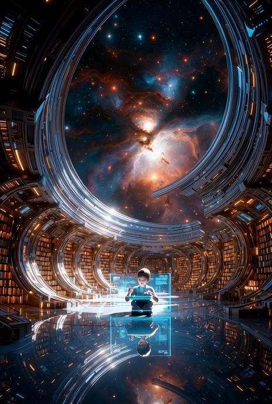
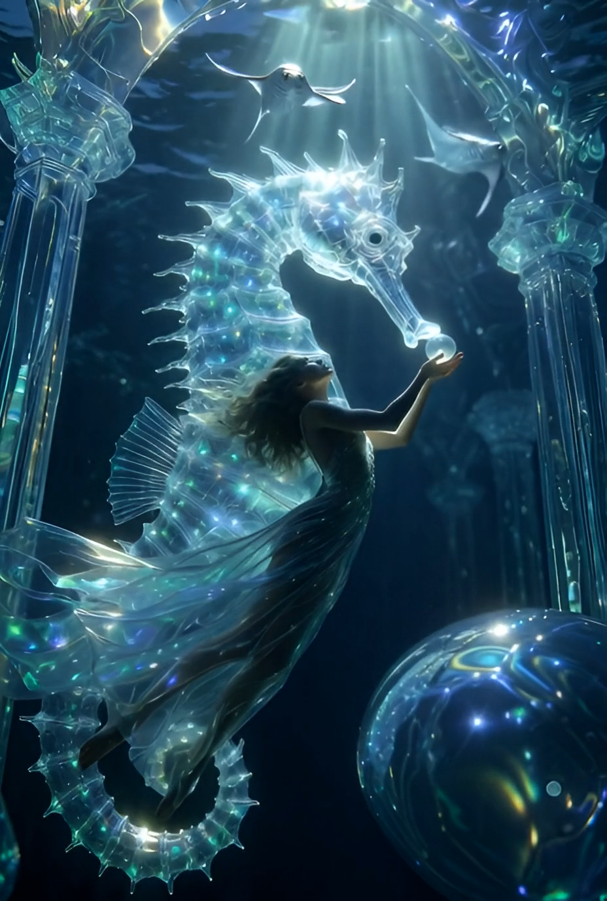
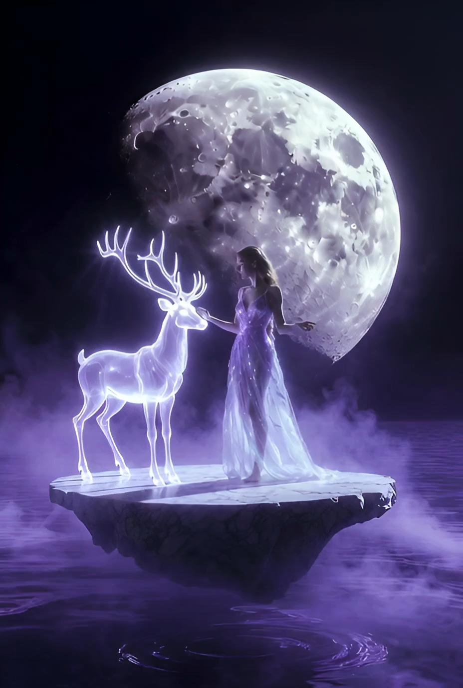
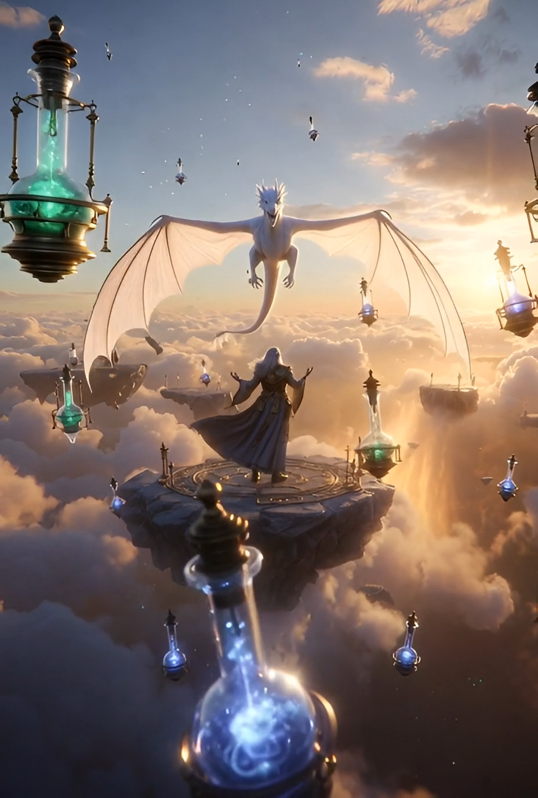

<a class="wx_topic_link">#AIGC</a> <a class="wx_topic_link">#星光造物</a> 

```
A cinematic portrait of The Eternal Librarian in a celestial archive, holding a glowing tome, with an owl and infinite shelves.
```


```
A cinematic portrait of The Eternal Librarian in a celestial archive, holding a glowing tome, with an owl and infinite shelves.
```



```
A cosmic cinematic clip of a beautiful woman and celestial fox in a galactic library, revealing knowledge.
```


```
A celestial woman explores an underwater cathedral with bioluminescent creatures, in a serene, cinematic style.
```



```
A mystical scene with an enchantress and astral deer on a floating platform above a lunar lake, under a cracked moon.
```



```
A cosmic-cinematic scene of a beautiful woman and her celestial owl in a vast galaxy library.
```


```
A steampunk mage ascends on a floating platform, surrounded by relics and a dragon, in a cinematic sky realm.
```


