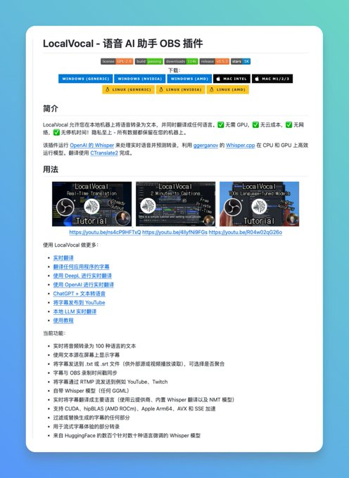

做直播或录制视频时，想给视频画面加上实时字幕，发现要么得用付费的云服务，要么得后期慢慢做，确实挺麻烦的。

逛 GitHub 时偶然发现了 LocalVocal 这个开源插件，专门为 OBS 打造的本地化语音转文字方案。

直接在本地运行 AI 模型，实时将语音转化为高质量字幕，甚至能同步翻译（如中译英）。无需联网，更不用支付昂贵的 API 费用。

GitHub：http://github.com/royshil/obs-localvocal

核心基于 ggml 和 Whisper 模型构建，作为一个标准的 OBS 滤镜存在，配置非常简单。

并且支持自定义模型大小，可根据自己电脑配置在速度和精度间灵活选择。

如果你是主播或需要录制带字幕的教学视频，这个零成本、低延迟的离线方案值得尝试。

