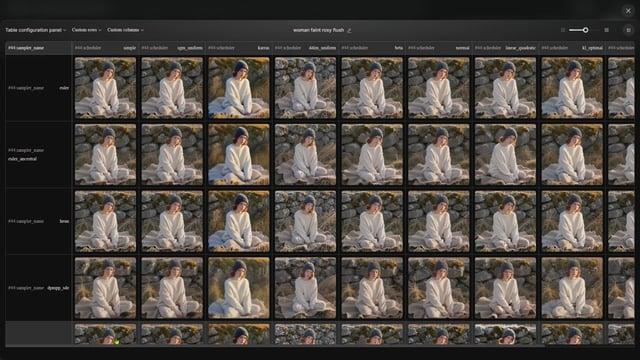
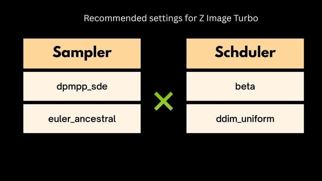
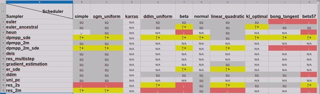

# Perfect Z Image Settings: Ranking 14 Samplers & 10 Schedulers
完美 Z 图像设置：14 个采样器和 10 个调度器排名

Tutorial - Guide

*   
*   
*   

Page 1 (Current page)Page 2Page 3Item 1 of 3

I tested 140 different sampler and scheduler combinations so you don't have to!
我已经测试了 140 种不同的采样器和调度器组合，所以你不用再测试了！

After generating 560 high-res images (1792x1792 across 4 subject sets), I discovered something eye-opening: default settings might be making your AI art look flatter and more repetitive than necessary.
在生成了 560 张高分辨率图像（4 个主题组，每张 1792x1792）之后，我发现了一些令人大开眼界的事情：默认设置可能会使你的 AI 艺术作品看起来比必要的更扁平、更重复。

Check out this video where I break it all down:
请观看这段视频，我会在视频中详细讲解：

<https://youtu.be/e8aB0OIqsOc>

You'll see side-by-side comparisons showing exactly how different settings transform results!
您将看到并排对比，清楚地显示不同的设置如何影响结果！

Upvote401Downvote63Go to commentsShare
