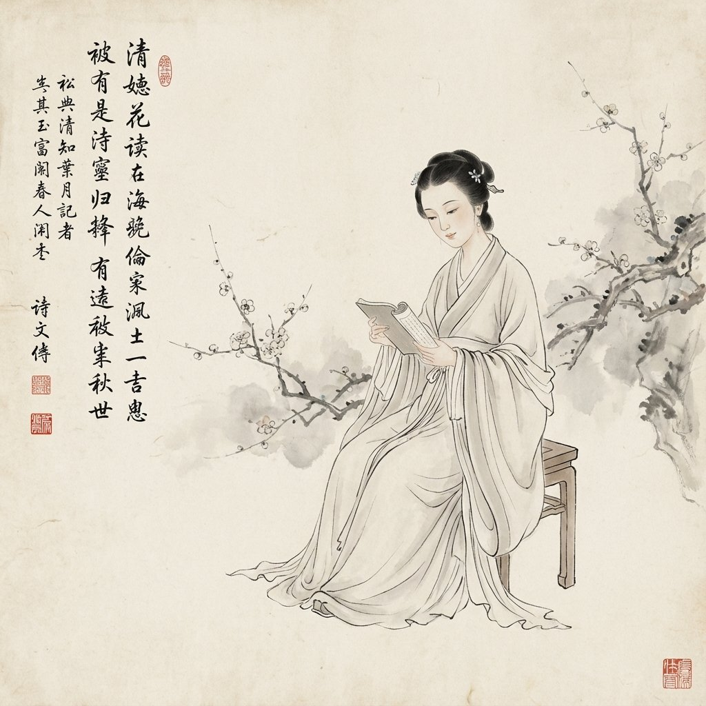
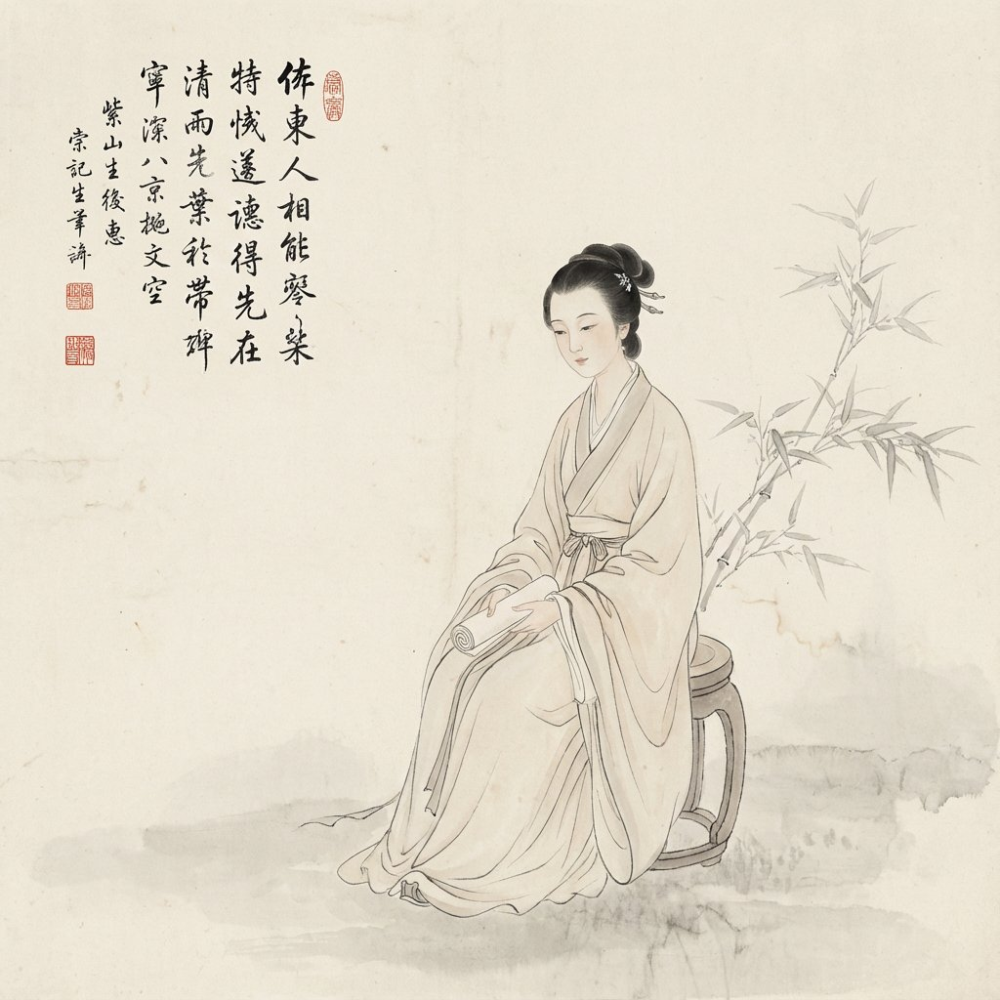

测试新做skill的能力

提问：水墨画风格的女性，要求在画中，宋式美学风格

⏺ 好的！让我按照路由规则分析你的请求：

路由分析：

STEP 1: "水墨画风格的女性" → 包含 "女性" → 有人物 ✅

STEP 3: 冲突场景判断
- 请求涉及：人物（女性）+ 艺术风格（水墨画 + 宋式美学）
- 用户说 "要求在画中" → 可能更关注艺术作品的整体意境

我注意到你的请求涉及：

A. 人物肖像路线 → intelligent-prompt-generator
- 专长：人物五官、表情、妆容、人种推理
- 使用人像框架（491个portrait元素）
- 将 "水墨画" 和 "宋式美学" 作为 art_style 参数
- 生成：人物细节丰富 + 水墨画渲染风格

B. 艺术作品路线 → art-master
- 专长：艺术技法、笔触、留白、意境
- 使用艺术框架（51个art元素）
- 强调宋代绘画美学、构图、意境
- 生成：宋代仕女图风格，注重艺术性和文化意境

---
你更关注：

A. 人物细节（五官、表情、妆容、服饰）→ intelligent-prompt-generator

B. 艺术意境（宋代绘画美学、留白、笔触、文人画意境）→ art-master

请选择 A 或 B？

回答：成年人都要！

结果出来的提示词如下：

Traditional Chinese ink wash painting of elegant lady in Song Dynasty aesthetic,
refined gongbi (meticulous brush) technique combined with baimiao (plain line
drawing) style, delicate yousi miao (gossamer thread) brushstrokes defining
graceful contours with consistent fine lines, subtle ink gradations and minimal
color palette of pale washes,

Song Dynasty female figure in simple yet elegant hanfu dress with understated
beauty, hair styled in modest Song Dynasty fashion with minimal ornaments,
serene and contemplative expression embodying scholarly refinement, gentle
posture suggesting cultured restraint and inner tranquility, embodying Song
Neo-Confucian ideals of feminine virtue and intellectual grace,

Masterful use of negative space (liu bai) surrounding the figure creating
poetic emptiness and philosophical depth, minimalist composition with vast
areas of untouched Xuan paper, atmospheric suggestion rather than detailed
background, few delicate elements like sparse plum branches or bamboo leaves
rendered in faint ink washes,

Traditional Xuan rice paper texture with visible fiber patterns and natural
absorbency, ink bleeding and feathering effects creating soft ethereal quality,
monochromatic black ink with subtle grey tones and occasional pale color
accents (dan cai), restrained elegance avoiding decorative excess,

Song Dynasty painting principles of simplicity and restraint, literati painting
(wenren hua) aesthetic emphasizing spiritual essence over physical likeness,
contemplative mood with philosophical undertones, timeless classical beauty,

Left or right side calligraphic inscription in elegant running script (xing shu)
with classical poetry about feminine grace or nature contemplation, multiple
vermillion seal stamps including artist's name seal and leisure seal, red
cinnabar contrasting with monochromatic palette, authenticating marks suggesting
Song Dynasty master painter heritage,

Museum-quality traditional Chinese figure painting, refined scholarly taste,
poetic atmosphere, embodying Song aesthetic of "yi jing" (artistic conception
and mood), masterwork of classical Eastern art

