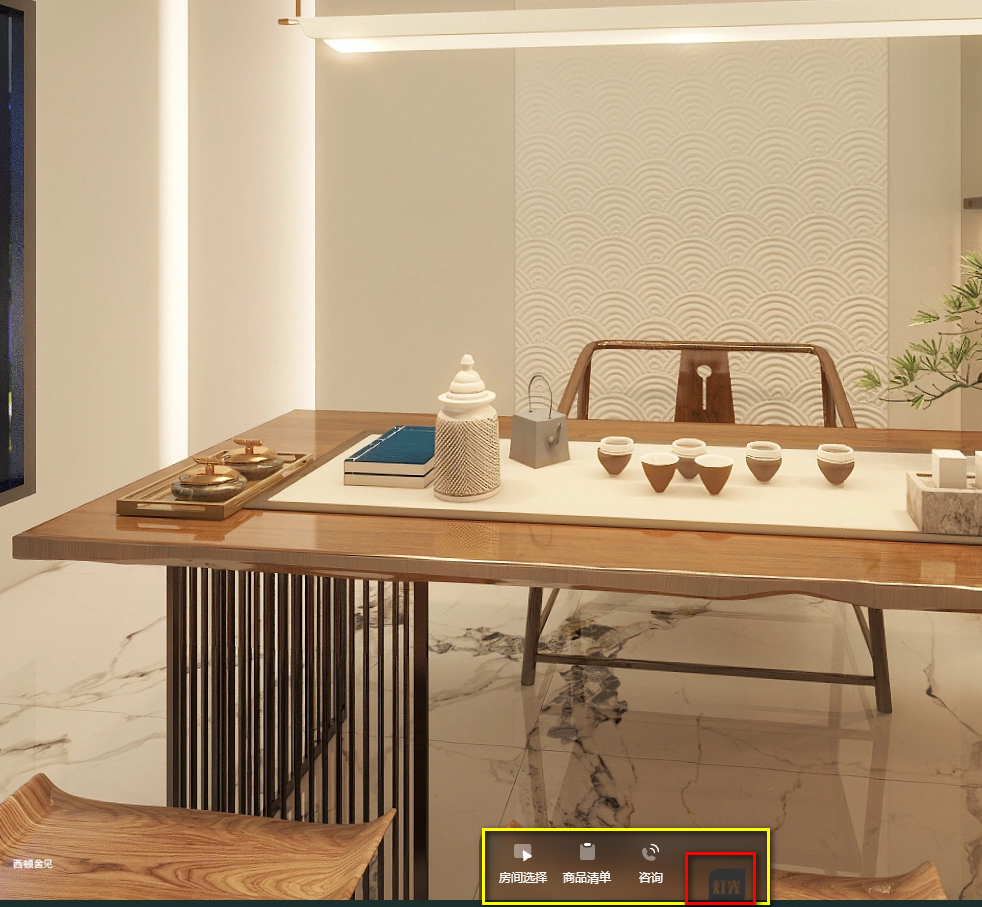
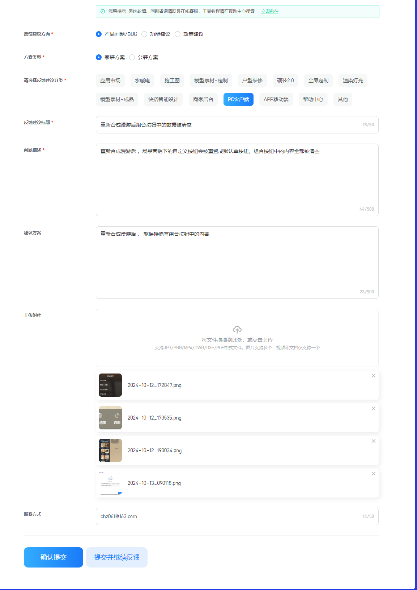
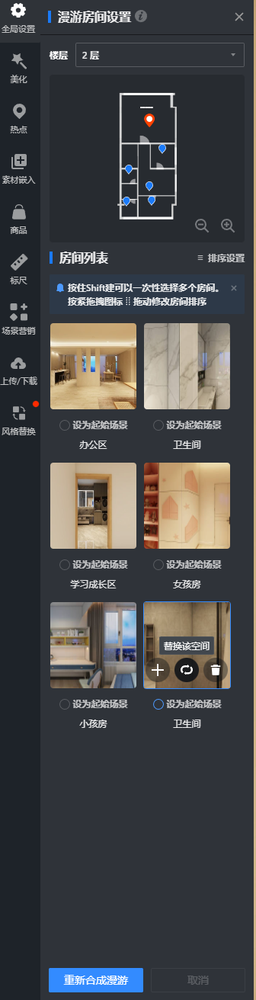
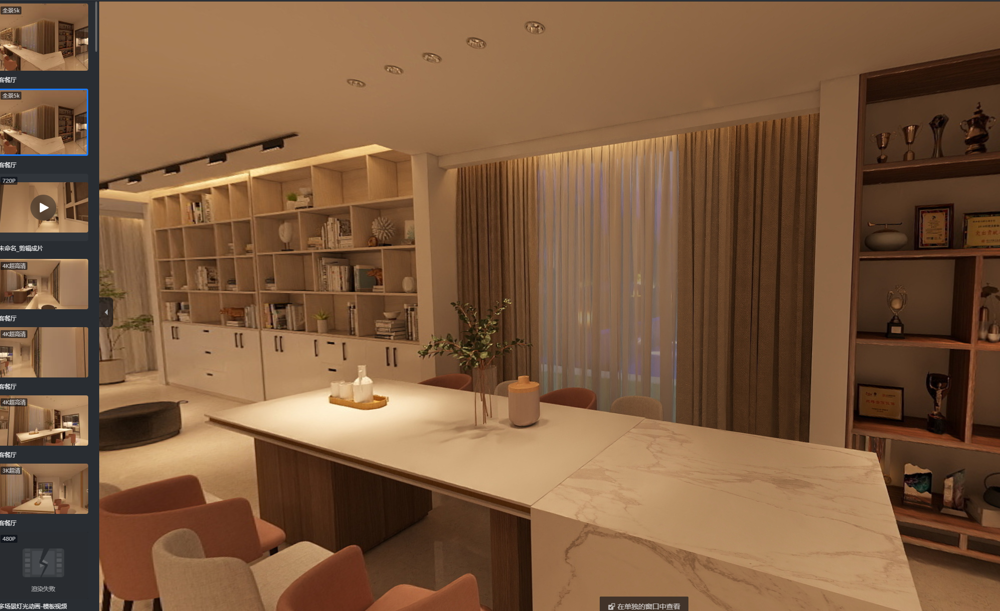
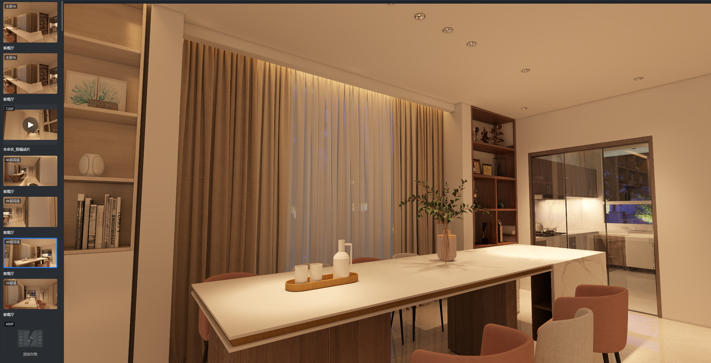

酷家乐使用过程中的BUG 

#  720全景下的组合按钮无法对齐
tag: 	PC客户端
720全景下的组合按钮无法对齐，单按钮可以对齐默认图标或自定义图标，但多按钮使用默认按钮还是自定义图标功能都无法对齐，主要出现在PC端 手机端又是正常的

# 立面图时调整时相机也会发生变化
tag: 	渲染灯光
立面图时调整时相机也会发生变化 无法稳定在立面调整灯光

# 重新设定场景后

多项按钮 菜单被重置

# 如果不点重新合成漫游 ，替换空间场景（普通图和全景图）不起作用

----------
# 同样参数下，单帧效果和全景效果图的差异

