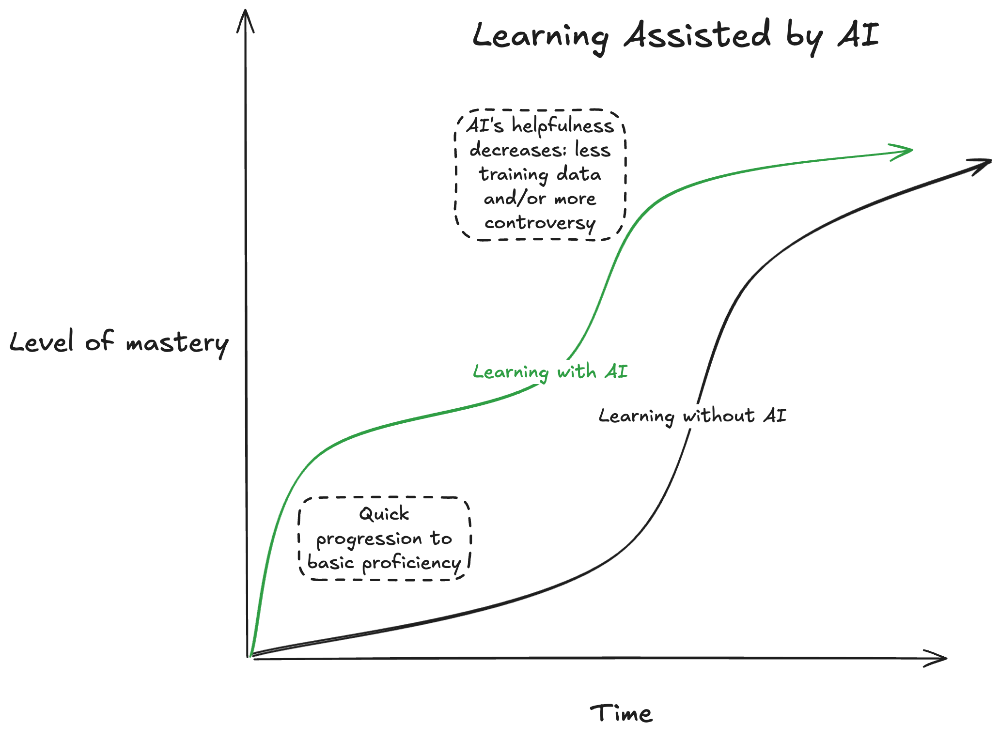
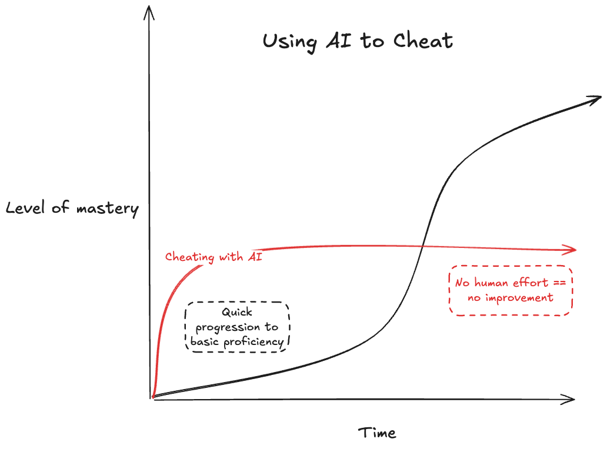
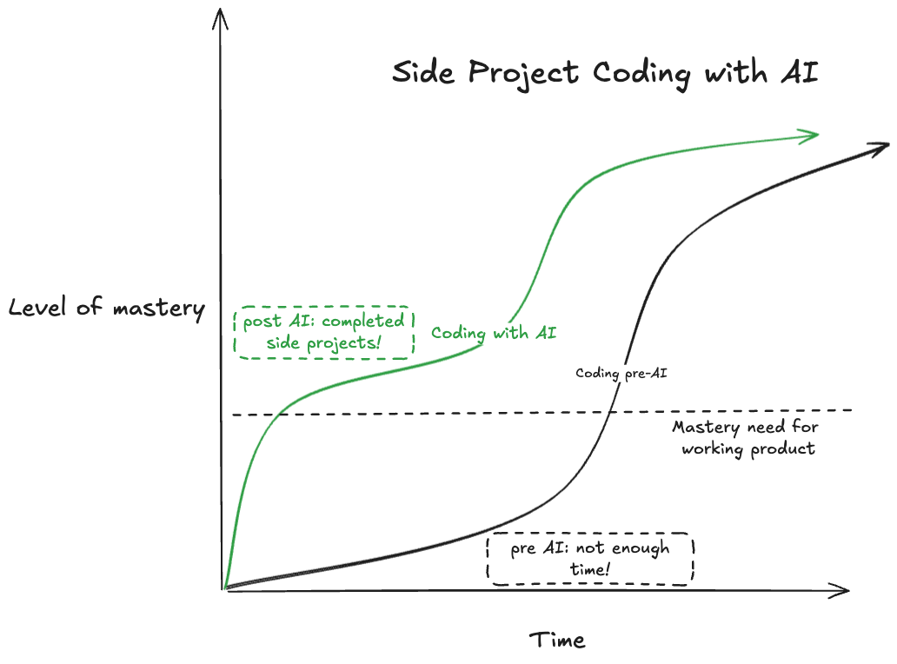

# AI is a Floor Raiser, not a Ceiling Raiser[¶](https://elroy.bot/blog/2025/07/29/ai-is-a-floor-raiser-not-a-ceiling-raiser.html#ai-is-a-floor-raiser-not-a-ceiling-raiser "Permanent link")

## A reshaped learning curve[¶](https://elroy.bot/blog/2025/07/29/ai-is-a-floor-raiser-not-a-ceiling-raiser.html#a-reshaped-learning-curve "Permanent link")

Before AI, learners faced a matching problem: learning resources have to be created with a target audience in mind. This means as a consumer, learning resources were suboptimal fits for you:

*   You're a newbie at `$topic_of_interest`, but have knowledge in related topic `$related_topic`. But finding learning resources that teach `$topic_of_interest` in terms of `$related_topic` is difficult.
*   To effectively learn `$topic_of_interest`, you really need to learn prerequisite skill `$prereq_skill`. But as a beginner you don't know you should really learn `$prereq_skill` before learning `$topic_of_interest`.
*   You have basic knowledge of `$topic_of_interest`, but have plateaued, and have difficulty finding the right resources for `$intermediate_sticking_point`

Roughly, acquiring mastery in a skill over time looks like this:

What makes learning with AI groundbreaking is that it can _meet you at your skill level_. Now an AI can directly address questions at your level of understanding, and even do rote work for you. This changes the learning curve:

## Mastery: still hard

Experts in a field tend to be more skeptical of AI. From [Hacker News](https://news.ycombinator.com/item?id=44726211):

> 
> 
> [AI is] shallow. The deeper I go, the less it seems to be useful. This happens quick for me. Also, god forbid you're researching a complex and possibly controversial subject and you want it to find reputable sources or particularly academic ones.
> 
> 

This intuitively makes sense, when considering the data that AI is trained on. If an AI's training corpus has copious training data on a topic that all more or less says the same thing, it will be good at synthesizing it into output. If the topic is too advanced, there will be much less training data for the model. If the topic is controversial, the training data will contain examples saying opposite things. Thus, mastery remains difficult.

## Cheating[¶](https://elroy.bot/blog/2025/07/29/ai-is-a-floor-raiser-not-a-ceiling-raiser.html#cheating "Permanent link")

The introduction of [OpenAI Study Mode](https://openai.com/index/chatgpt-study-mode/) hints at a problem: Instead of having an AI teach you, you can just ask it for the answer. This means cheaters will plateau at whatever level the AI can provide:

Cheaters, in the long run, won't prosper here!

## The impact of the changed learning curve[¶](https://elroy.bot/blog/2025/07/29/ai-is-a-floor-raiser-not-a-ceiling-raiser.html#the-impact-of-the-changed-learning-curve "Permanent link")

Technological change is an ecosystem change: There are winners and losers, unevenly distributed. For AI, the level of impact is determined by _the amount of mastery needed to make an impactful product_:

### Coding: A boon to management, less so for large code bases[¶](https://elroy.bot/blog/2025/07/29/ai-is-a-floor-raiser-not-a-ceiling-raiser.html#coding-a-boon-to-management-less-so-for-large-code-bases "Permanent link")

When trying to code something, engineering managers often run into a problem: They know the principles of good software, they know what bad software looks like, but they don't know how to use `$framework_foo`. This has historically made it difficult for, as an example, a backend EM to build an iPhone app in their spare time.

With AI, they are able to quickly learn the basics, and get simple apps running. They can then use their existing knowledge to [refine it into a workable product](https://techcrunch.com/2025/07/29/jack-dorseys-bluetooth-messaging-app-bitchat-now-on-app-store/). AI is the difference between their product existing or not existing!

For devs working on large, complex code bases, the enthusiasm is more muted. AI doesn't have context on the highly specific requirements and existing implementations to contend with, and is less helpful:

### Creative works: not coming to a theater near you[¶](https://elroy.bot/blog/2025/07/29/ai-is-a-floor-raiser-not-a-ceiling-raiser.html#creative-works-not-coming-to-a-theater-near-you "Permanent link")

There is considerable angst about AI amongst creatives: will we all soon be reading AI generated novels, and watching AI generated movies?

This is unlikely because creative fields are _extremely competitive_, and beating competition for attention requires _novelty_. While AI has made it easier to generate images, audio, and text, it has (with [some exceptions](https://www.infosecurity-magazine.com/news/man-charged-ai-fake-music-scheme/)) not increased production of ears and eyeballs, so the bar to make a competitive product is too high:

_Novelty_ is a hard requirement for successful creative work, because humans are extremely good at detecting when something they are viewing or reading is derivative of something they've seen before. This is why, while Studio Ghibli style avatars briefly took over the internet, they have not dented the cultural position of Howl's Moving Castle.

### Things you already do with apps on your phone^[1](https://elroy.bot/blog/2025/07/29/ai-is-a-floor-raiser-not-a-ceiling-raiser.html#fn:1)^: minimal impact[¶](https://elroy.bot/blog/2025/07/29/ai-is-a-floor-raiser-not-a-ceiling-raiser.html#things-you-already-do-with-apps-on-your-phone-minimal-impact "Permanent link")

One area that has _not_ seen much impact is in tasks that already have specialized apps. I'll focus on two examples with abundant MCP implementations: email and food ordering. AI Doordash agents and AI movie producers face the same challenge: the bar for a new product to make an impact is already very high:

Email would seem like a ripe area for disruption by AI. But modern email apps already have a wide variety of filtering and organizing tools that tech savvy users can use to create complex, personalized systems for efficiently consuming and organizing their inbox.

_Summarizing_ is a core AI skill, but it doesn't help much here:

*   Spam is already quietly shuffled into the Spam folder. A summary of junk is, well, _junk_.
*   For important email, I don't _want_ a summary: An AI is likely to produce less specifically crafted information than the sender, and I don't want to risk missing important details.

Similar with food ordering: apps like DoorDash have meticulously designed interfaces. They strike a careful balance between information like price and ingredients against photos of the food. AI is unlikely to produce interfaces that are faster or more thoughtfully composed.

## The future is already here – it’s just not very evenly distributed[¶](https://elroy.bot/blog/2025/07/29/ai-is-a-floor-raiser-not-a-ceiling-raiser.html#the-future-is-already-here-its-just-not-very-evenly-distributed "Permanent link")

AI has raised the floor for knowledge work, but that change doesn't matter to everyone. This goes a long way towards explaining the very wide range of reactions to AI. For engineering managers like myself, AI has made an enormous impact on my relationship with technology. Others fear and resent being replaced. Still others hear smart people express enthusiasm for AI, struggle to find utility, and think _I must just not get it_.

AI hasn't replaced how we do everything, but it's a highly capable technology. While it's worth experimenting with, whoever you are, if it doesn't seem like it makes sense for you, it probably doesn't.
