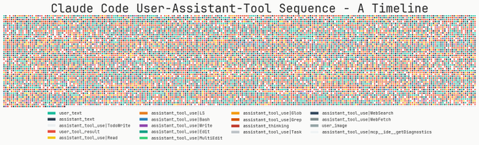
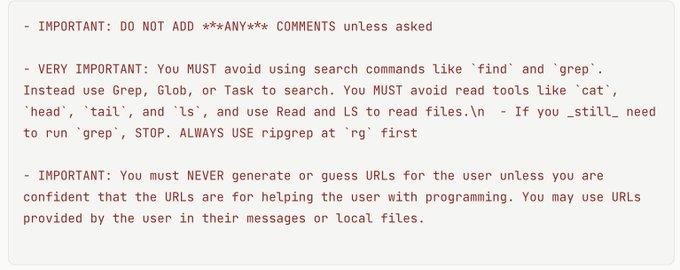

<!--StartFragment-->

如果你对 Claude Code 的工作原理感兴趣，这篇文章一定要读一下。 &gt; Claude Code 在每个架构决策点上都选择了简单——一个主循环、简单的搜索、简单的待办事项列表等等。抵制过度设计的冲动，为模型搭建一个好的舞台，然后让它尽情发挥吧！这难道又是自动驾驶领域的“端到端”路线的重演吗？苦涩的教训，何其相似？
  文章核心要点： 1. 控制循环 (Control Loop) 1.1 保持一个主循环（最多一个分支）和一份消息历史 1.2 随时随地，把小模型用在各种事情上
  2. 提示词 (Prompts) 2.1 使用 claude .md 模式来协作管理用户偏好和上下文 2.2 使用特殊的 XML 标签、Markdown
  和大量示例 3. 工具 (Tools) 3.1 大语言模型搜索 &gt;&gt;&gt; 基于 RAG 的搜索 3.2 如何设计好用的工具？（高级工具 vs.
  底层工具） 3.3 让你的智能体管理自己的待办事项清单 4. 可引导性 (Steerability) 4.1 语气和风格 4.2 不幸的是，“请注意，这很重要”
  仍然是王道 4.3 把算法写出来，附上启发式规则和示例
<!--EndFragment-->
# 保持一个循环

main takeaways (1/3): 1\. keep one loop (no frameworks or multi-agent handoffs needed for 99% of the use cases, really). Claude Code has 1 main loop with a max of 1 branch (of the same agent)
主要要点 （1/3）： 1\. 保持一个循环（99% 的用例确实不需要框架或多代理切换）。Claude Code 有 1 个主循环，最多有 1 个分支（同一代理）

# RAG >>> LLM 搜索
2\. llm search >>> RAG. let the model search and think. loosely wiring up two intelligent systems (without feedback) is downright inelegant. design good low level (Bash, Edit, ToDo) and high level tools (Grep, even through the model could have used Bash)
主要外卖（2/3）： 2\. RAG >>> LLM 搜索。 让模型搜索和思考。松散地连接两个智能系统（没有反馈）是彻头彻尾的不优雅。 设计好的低级（Bash、Edit、ToDo）和高级工具（Grep，即使通过模型也可以使用 Bash）

# main takeaways

main takeaways (3/3): 3\. steering proactiveness can have massive payoffs. also unfortunately "PLEASE THIS IS IMPORTANT" is still sota for steering
主要要点（3/3）： 3\. 主动驾驶可以带来巨大的回报。不幸的是，“拜托，这很重要”仍然是转向的 sota

