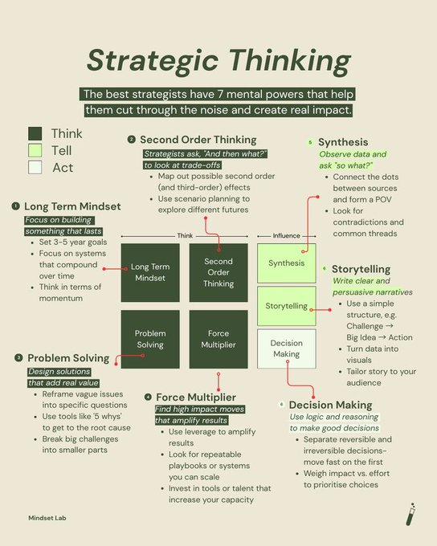

找到一张旧图 - “战略性思维”（Strategic Thinking）的七个核心能力，周末分享给大家 这七种“心智力量”可以分为三大类：思考、讲述 和行动！

第一部分：思考 (Think) 这部分是战略思维的基础，包含了四种核心能力：

1\. 长期思维 (Long Term Mindset) ：着眼于建立能够持久发展的事物。设定3-5年的长远目标；关注那些能够随着时间推移产生复利效应的系统；从“势头”（momentum）的角度思考，让优势持续累积。

2\. 解决问题 (Problem Solving)：设计能够增加真实价值的解决方案。将模糊、宽泛的问题，重新定义为具体、可操作的问题；使用“五个为什么”（5 Whys）等工具，深挖问题的根本原因；将宏大的挑战分解成更小、更易于管理的部分。

3\. 二阶思维 (Second Order Thinking)： 思考决策的连锁反应，而不仅仅是直接后果。不断追问“然后呢？”，以审视决策可能带来的各种权衡和取舍；规划出决策可能带来的第二层、甚至第三层的影响；利用情景规划（scenario planning）来探索未来的多种可能性。

4\. 力量倍增器 (Force Multiplier)： 找到那些能够“四两拨千斤”、极大化成果的高影响力举措。利用杠杆（leverage）来放大成果；寻找可以被复制和规模化的成功模式（playbooks）或系统；投资于能够提升团队或个人整体能力的工具或人才。

第二部分：讲述 (Tell) 这部分强调将思考的成果转化为能够影响他人的信息。

5\. 综合分析 (Synthesis)： 提炼信息，形成自己独特的观点（Point of View）。观察数据后，要追问“所以呢？”，挖掘其背后的商业含义；连接不同来源的信息点，找出其中的内在联系；留意信息中的矛盾之处和共同的线索。

6\. 故事叙述 (Storytelling)： 用清晰且有说服力的叙事来传递观点。采用简单的叙事结构，例如：“挑战 → 核心理念 → 行动方案”；将枯燥的数据转化为直观的视觉化图表；根据听众的背景和关注点，量身定制你的故事。

第三部分：行动 (Act) 这是战略思维的最终落脚点，即做出明智的决策。

7\. 决策制定 (Decision Making)： 运用逻辑和理性做出高质量的决定。区分“可逆的决策”和“不可逆的决策”；对于可逆的决策，要快速行动；通过权衡“预期影响”与“所需投入”，来确定各项选择的优先级。

策略思考是一个从“深度思考”到“有效沟通”，再到“明智行动”的完整闭环
