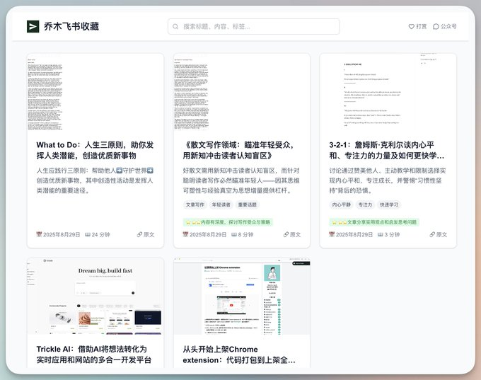
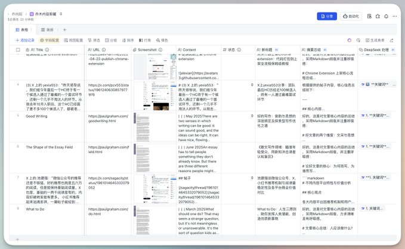

任何网页，仅需一次点击，自动生成网站文章！ 核心体验： 点 Chrome 插件 -> 飞书多维表格 -> AI 自动处理 -> 生成网站 + 文章 我的理解 1\. 飞书依然是最好的在线笔记工具，但收藏整理信息不便。 2\. 多维表格是与 AI 结合最好的信息整理工具，可惜阅读体验差。 3\. 网站是最好的内容阅读，兼容性好。 4\. Chrome是最佳网页收藏工具，权限大，甚至能截屏。 整合一系列工具，让人人轻松管理自己的网页信息源。 代码预计下周全部开源。 评论区有用这套系统，免费用Vercel搭建好的体验网址。

