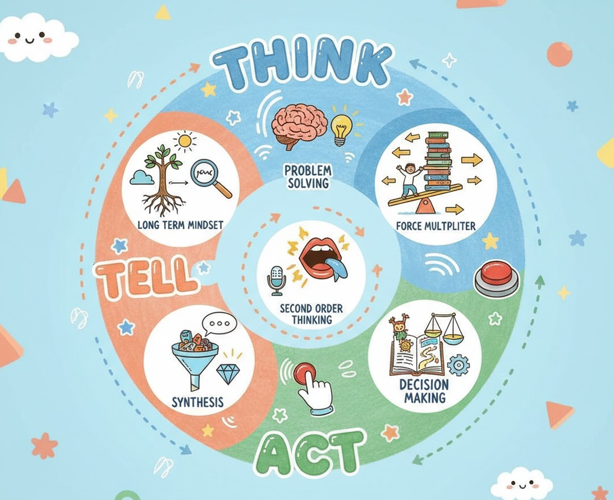

<!--StartFragment-->

小朋友们，大家好！今天我们要聊聊怎么变得更聪明，就像一个小小“策略家”！

我找到一张很酷的图，里面讲了7个小秘密，只要学会它们，你就能更会想事情、更会表达、更会做事！

这7个秘密分成三组： 会思考 、 会讲出来 、 会去做 ！

### 第一组：会思考 (Think)

这一组有4个小秘密，它们是你想事情的基础：

1.  看长远 ：就像你玩游戏，不能只看眼前这一关，要想想怎么才能玩得久、玩得好。 比如，想想未来3年、5年你想变成什么样？做一件事情，要看看它能不能像滚雪球一样，越滚越大，让你越来越厉害。

2.  解决问题 ：就是遇到难题，你能想办法解决它，而且解决得很好。 比如，遇到一个大难题，先把它分成好多小难题，一个一个解决。还可以问自己“为什么会这样？为什么？为什么？”多问几个为什么，就能找到问题的根源。

3.  多想一步 ：做一件事情，不能只看它会发生什么，还要想想“然后呢？接下来会发生什么？” 比如，你决定放学去打篮球，那就要想想，打完篮球会不会写作业写到很晚？第二天上课会不会没精神？多想想几步，就能做出更好的选择。

4.  找到“超级杠杆” ：就是找到那个最省力、效果却最好的方法。 就像玩跷跷板，只要找到支点，用一点点力气就能翘起很重的东西。在学习和生活中，也要找那些“事半功倍”的方法，让你用小力气办成大事！

### 第二组：会讲出来 (Tell)

这一组有2个小秘密，它们是教你怎么把你想到的好主意告诉别人：

1.  总结高手 ：就是把你看到、听到的东西，总结成自己的想法。 比如，你看了很多关于恐龙的书，就要想想“所以呢？这些书告诉我什么有趣的恐龙秘密？”然后把这些秘密串起来，变成你自己的“恐龙知识”。

2.  讲故事 ：把你的想法像讲故事一样说出来，让别人一听就懂，而且觉得很有道理。 讲故事可以很简单，先说你遇到了什么难题，然后你有什么好主意，最后你要怎么做。还可以用画画的方式，把那些复杂的东西画出来，让大家看得更清楚。

### 第三组：会去做 (Act)

这一组是最后一个小秘密，它教你怎么做出正确的决定：

1.  会做决定 ：就是用你的聪明才智，做出最棒的选择。 有些决定，做错了可以改回来，那就可以快点做。有些决定，做错了就很难改了，那就要多想想、多比较。做决定的时候，想想哪个选择带来的好处最大，付出的代价最小。

所以，“策略思考”就像一个魔法圈，先是 好好想一想 ，然后 清楚地讲出来 ，最后 聪明地去做 ！

希望大家都能成为小小“策略家”，越来越聪明！

<!--EndFragment-->
 

