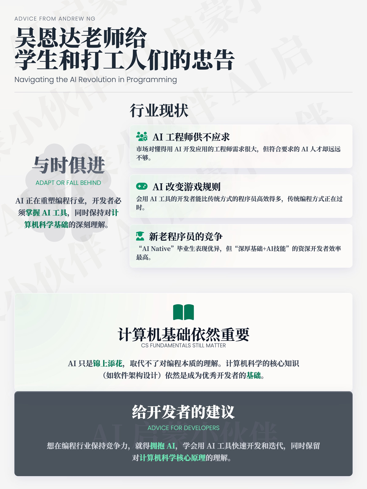

吴恩达老师给学生和打工人们的忠告：AI 正在重塑编程行业，开发者必须与时俱进，掌握 AI 工具，同时保持对计算机科学基础的深刻理解，才能在未来脱颖而出。

AI 工程师需求旺盛，但供给不足  
   吴恩达老师指出，现在市场对懂得用 AI 开发应用的工程师需求很大，但符合要求的 AI 人才却远远不够。很多大公司和初创企业都急需能快速用 AI 工具开发系统的人才。这种“供不应求”的情况随着 AI 的普及只会越来越明显。

传统编程方式过时，AI 改变游戏规则  
   编程行业正在经历一场类似从打孔卡到键盘终端的革命性变化。过去（比如2022年之前），程序员主要靠手写代码，但现在有了生成式 AI，编程方式彻底变了。会用 AI 工具（比如提示工程、RAG、评估、智能体工作流等）的开发者能比传统方式的程序员高效得多。吴恩达老师在招聘时更看重候选人是否能快速用 AI 构建和迭代应用，而不是只看传统的编码能力。

新毕业生与老程序员的竞争  
   现在有一种现象：一些刚毕业的“AI Native”大学生，因为熟练掌握 AI 工具，表现甚至超过了一些经验丰富但仍用“2022年老方法”编程的开发者。不过，吴恩达老师认为，最厉害的程序员还是那些既有深厚计算机基础、懂得复杂软件架构，又能紧跟 AI 技术潮流的资深开发者。他们结合传统知识和现代 AI 技能，效率最高。

计算机基础依然重要，但部分技能已过时  
   虽然 AI 让一些传统技能（比如记代码语法）变得不那么重要了，但吴恩达老师强调，计算机科学的核心知识（比如理解计算机工作原理、软件架构设计等）依然是成为优秀开发者的基础。AI 只是锦上添花，取代不了对编程本质的理解。

CS 毕业生就业的两极分化  
   现在计算机科学（CS）专业的毕业生面临一个矛盾现象：一方面，AI 工程师的薪资在上涨，机会很多；另一方面，一些 CS 毕业生却找不到工作。这是因为很多大学的课程还没跟上 AI 时代的步伐，导致毕业生缺乏市场需要的 AI 技能。虽然 CS 毕业生的“低就业率”（做非专业相关工作）比其他专业低，但失业率确实有所上升。

给开发者的建议  
   吴恩达老师的建议很明确：想在编程行业保持竞争力，就得拥抱 AI，学会用 AI 工具快速开发和迭代，同时保留对计算机科学核心原理的理解。光靠“感觉”写代码是远远不够的，扎实的基础加上 AI 技能才是王道。