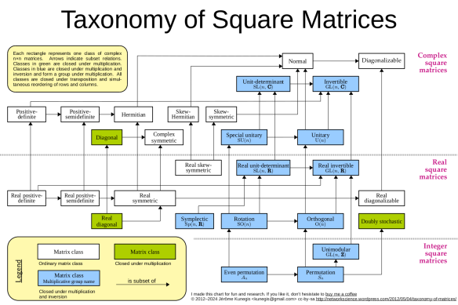

# Taxonomy of Matrices

Posted on 2012-05-04

Normal matrices, diagonalizable matrices, orthogonal matrices, unitary matrices… the classes of matrices used in math, computer science and other areas can be quite complex and difficult to grasp sometimes. To get an overview of the different classes of complex n-by-n matrices, I made the following diagram:

[Chart as PNG](https://networkscience.wordpress.com/wp-content/uploads/2012/05/matrix-taxonomy-4.png)

[Chart as PDF – with embedded links to Wikipedia](https://networkscience.wordpress.com/wp-content/uploads/2012/05/matrix-taxonomy-3.pdf "matrix-taxonomy")

This diagram is released as [cc-by-sa](http://creativecommons.org/licenses/by-sa/3.0/de/deed.en). That means you can use and modify it, as long as you acknowledge me (just link to [this page](https://networkscience.wordpress.com/2012/05/04/taxonomy-of-matrices/)), and publish any modifications also under cc-by-sa.

In this diagram, each rectangle represents one set of complex n-by-n matrices. Arrows represent subset relations. There is lots of information in there, and every arrow tells a story. For instance, all rotation matrices have determinant 1, explaining the arrow from “Rotation matrices” to “Real unit-determinant matrices”. I also colored the classes which are closed under matrix multiplication in blue. Also, I noted down the corresponding multiplicative group, for instance SO(n) with rotation matrices.

There are likely errors in there: I tried to be as diligent as possible, but with the large amount of information compressed into a single diagram, there are bound to be errors. Please comment if you find one!  Also, I did not include lesser-known classes of matrices (such as unistochastic or co-positive matrices), matrices whose definition makes use of the ordering of row and column indices (such as triangular or tridiagonal matrices) and classes that are not closed under the transpose operation (such as left and right stochastic matrices).

A few other observations:

*   The identity matrix is everything except skew-symmetric or skew-Hermitian.
*   The top of the hierarchy are diagonalizable and invertible matrices.
*   Are doubly stochastic matrices a subset of any other class?
*   What are the name of the groups generated by multiplication of double stochastic matrices?
*   There is a one-to-one correspondence between several complex and real classes.  This is however not systematic. For instance, real symmetric matrices can be generalized to complex symmetric matrices, and also to Hermitian matrices.
*   Many classes have alternate names. For instance, Hermitian matrices are called self-adjoint, and rotation matrices are called special orthogonal.
*   The classes of positive-definite and positive-semidefinite matrices is to be interpreted in the narrow sense, i.e., only such matrices that are Hermitian (or symmetric in the real case).  This is also the reason why the class of positive-definite matrices is not closed under multiplication.

I made this chart for fun and for research.  If you like it, don’t hesitate to [buy me a coffee](https://www.paypal.com/donate/?hosted_button_id=Q9JY2FB3AFHR6).

UPDATES

*   **The PDF version now contains hyperlinks to the Wikipedia articles about the matrix classes and groups.**
*   **Added symplectic and unimodular matrices**

*   **Added a legend**
*   **Added cc-by-sa license**
*   **Inserted note about positive-definite matrices**
*   **Removed link from complex-symmetric to normal, as discussed [here](https://en.wikipedia.org/wiki/Talk:List_of_named_matrices#Complex_symmetric_does_not_imply_normal)**
*   **Updated line width and fonts, added donation link**
