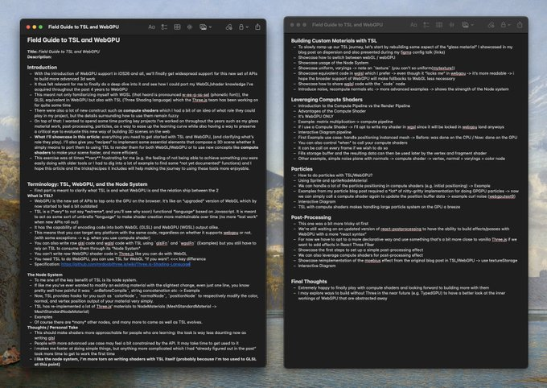

sneak peek at my upcoming blog post this summer I did a deep dive into WebGPU + TSL by (re)building lots of little demo scenes this article will contain many patterns, *recipes* and tricks I came up with to ease up your own journey into this new way to build 3D for the web
先睹为快我即将发布的博客文章 今年夏天，我通过（重新）构建许多小演示场景，深入研究了 WebGPU + TSL 本文将包含我提出的许多模式、*食谱*和技巧，以简化您自己的 Web 构建 3D 新方法的旅程

