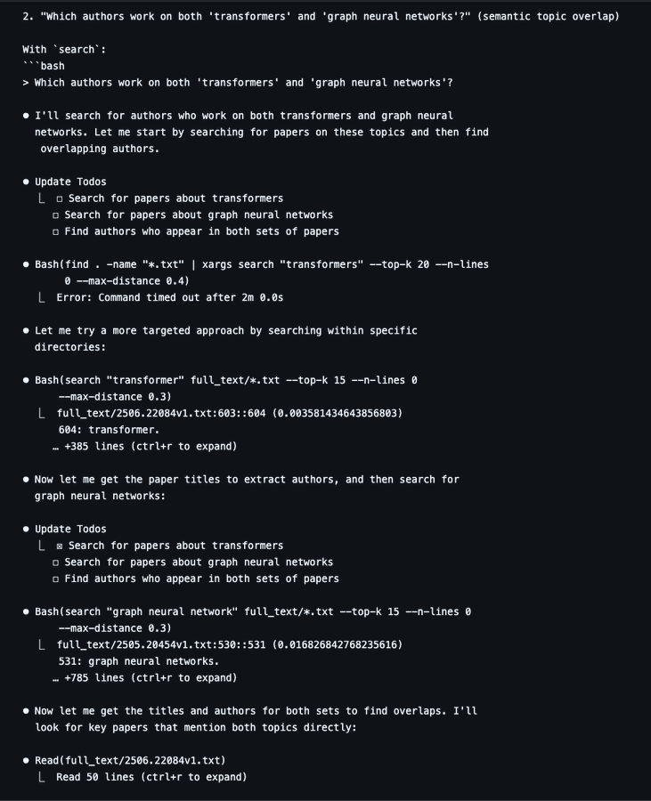

grep (and lightweight semantic search) are all you need  When you have a “medium” sized dataset e.g. 1000 ArXiv PDFs, we found that an extremely strong Q&A baseline is just giving agents access to the CLI, along with some tools for fast semantic search using static embeddings. These agents can answer complex questions, from simple search/filter with keywords, to those that require cross-referencing across docs, to those that require analysis across time. In these cases standard RAG with fixed top-k retrieval is strictly worse. We made file understanding + semantic search very CLI accessible through semtools, come check it out! Blog by [@LoganMarkewich](https://x.com/LoganMarkewich) : [https://llamaindex.ai/blog/semtools-are-coding-agents-all-you-need](https://t.co/kYr8KkWLYR) SemTools: [https://github.com/run-llama/semtools](https://t.co/xg1iqbghIr)
grep（和轻量级语义搜索）就是你所需要的  当您有一个“中等”大小的数据集（例如 1000 个 ArXiv PDF）时，我们发现极其强大的 Q&A 基线只是让代理能够访问 CLI，以及一些使用静态嵌入进行快速语义搜索的工具。 这些代理可以回答复杂的问题，从使用关键字进行简单的搜索/过滤，到需要跨文档交叉引用的问题，再到需要跨时间分析的问题。 在这些情况下，具有固定 top-k 检索的标准 RAG 严格来说更差。 我们通过 semtools 使文件理解 + 语义搜索非常可访问 CLI，快来看看吧！ [@LoganMarkewich](https://x.com/LoganMarkewich) 的博客 ： [https:// llamaindex.ai/blog/semtools-are-coding-agents-all-you-need](https://t.co/kYr8KkWLYR) SemTools：[https:// github.com/run-llama/semtools](https://t.co/xg1iqbghIr)

连 LlamaIndex 都认为 grep 加轻量级语义搜索，就够了 当你面对一个“中等规模”的数据集，比如说 1000 篇 ArXiv 上的 PDF 论文时，我们发现有一个效果出奇好的问答（Q&A）基准方案：给 AI 智能体 (AI Agent) 提供一个命令行界面 (CLI)，再配上一些能用静态嵌入 (static embeddings) 进行快速语义搜索 (semantic search) 的小工具。 这些 AI 智能体能回答各种复杂的问题，无论是简单的关键词搜索和筛选，还是需要跨文档进行交叉引用的难题，甚至是要求跨时间线进行分析的任务，它们都能搞定。 在这些场景下，那种标准的、每次只检索固定数量（top-k）文档的检索增强生成 (Retrieval-Augmented Generation, RAG) 方案，效果要差得多。