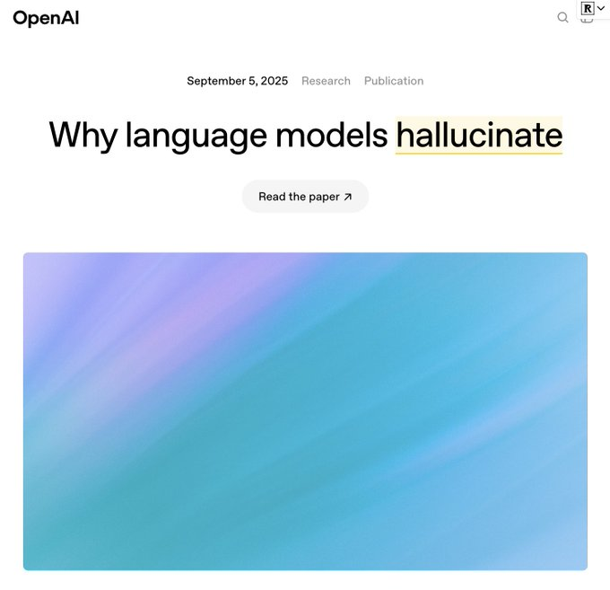

llm幻觉的分类、根本原因与解决方案 ｜openai 最新blog 《Why language models hallucinate》
===
信心满满张嘴就来、一本正经胡说八道，人类如此嘲讽llm的“幻觉” (Hallucination) 。

（其实，人类自己在这方面也相当不差🤣）

作为用户，以及有大量学习经验的人类学习者，我们可以根据实际经验，把 llm 幻觉大致分为两种：一种是预训练阶段，llm学习并记住了错误的知识，然后把错误信息当作正确知识，用于回答中（人也一样）；第二种是guessing，而不是直接说“我不知道”，或者给出多种可能性的不确定回答（人也一样）。

openai 分享了对llm幻觉的研究。llm 幻觉的根本原因，不只是模型本身，而在两个地方：

一个是llm的预训练阶段，数据局限性导致的幻觉；llm通过学习海量文本来“预测下一个词”，对于有规律的模式（语法、编程、通用知识），llm可以学得很好；但是，对于低频的事实（例如，路人甲xxx的宠物狗的生日），这些信息在训练数据中无规律可循，导致了llm的第一种幻觉；

另一个是以准确率得分为主的评估机制（accuracy-based evals），错误地奖励 llm的“战略性猜测”/瞎猜行为，错误地惩罚llm 放弃回答/“我不知道”的行为，这导致了第二种幻觉；

gpt-5 的一大提升，就是在消除llm幻觉上。gpt-5，学会了“谦卑”，某种意义上体现了某种程度的“元认知”：减少了“战略性猜测”行为，而选择“放弃”，直接说自己不知道。

这篇文章很有趣，值得读一读~~

