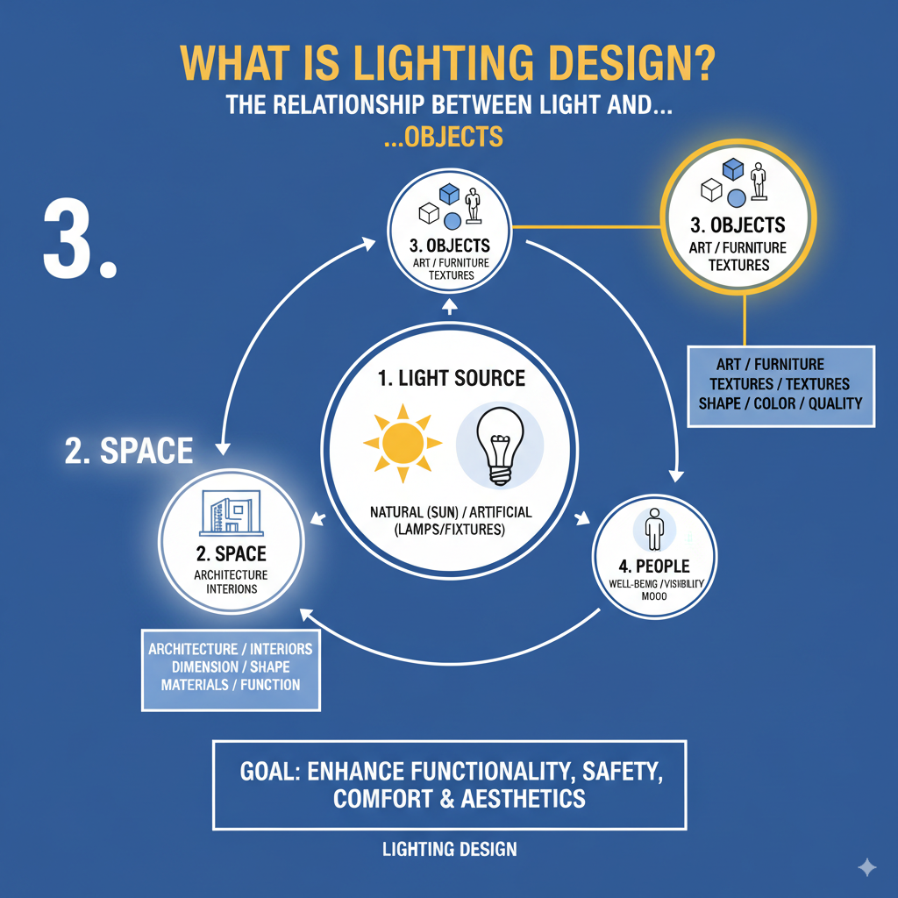

什么是照明设计？🤔 一文读懂光与我们生活的关系！
💡 每次走进一个空间，你有没有留意过那里的光线？是明亮舒适，还是昏暗压抑？这背后，都离不开一个专业领域——照明设计。
简单来说，照明设计就是有策略地规划和安装照明系统，以达到我们想要的美学或实用效果。它不只是装个灯那么简单，更深层次是理解光如何与我们的空间、物体和个人感受互动。
照明设计的核心目标： 提升空间的功能性、安全性、舒适度，以及最重要的——美观度！
想知道照明设计具体在“设计”些什么吗？我们用四组关系图来帮你清晰理解：
1. 一切从“光”开始：光源 (Light Source) ✨

光源，顾名思义，就是光的“出身”。它可以是温暖的自然光（比如阳光☀️），也可以是各种人造光（我们家里的灯具💡）。照明设计的
第一步，就是确定这些光的来源和特性。
光源，顾名思义，就是光的“出身”。它可以是温暖的自然光（比如阳光☀️），也可以是各种人造光（我们家里的灯具💡）。照明设计的第一步，就是确定这些光的来源和特性。

光源，顾名思义，就是光的“出身”。它可以是温暖的自然光（比如阳光☀️），也可以是各种人造光（我们家里的灯具💡）。照明设计的第一步，就是确定这些光的来源和特性。
2. 光的舞台：空间 (Space) 🏙️
Generated Image September 15, 2025 - 9:51PM.png
Generated Image September 15, 2025 - 9:51PM.png
Generated Image September 15, 2025 - 9:52PM.png

3\. 物体 (Objects)
光照亮空间中的物体，如艺术品、家具和纹理。光线可以突出物体的形状、颜色和质感。

4\. 人 (People)
最终，照明设计是为了影响和服务于在空间中的人。光线会影响人的幸福感、可见度和情绪。良好的照明能提高生产力，减少眼睛疲劳，并创造舒适的氛围。

28.8s
