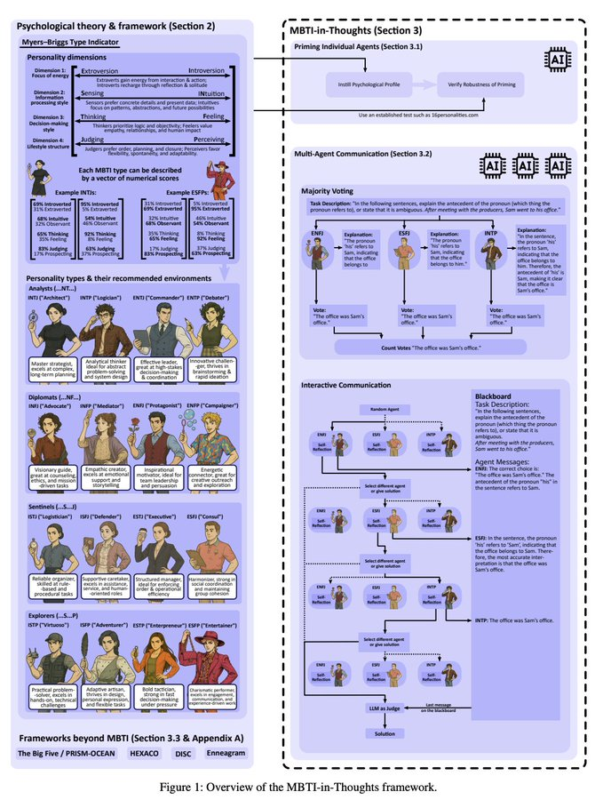

转译：有人发现了一个让 AI 智能体（AI Agent）工作更出色的绝妙方法，简单到令人惊讶：只要给它们设定一个人格。 我最近读了一篇关于“心理学增强型 AI 智能体”（Psychologically Enhanced AI Agents）的论文，它揭示了一个引人入注的观点：我们无需进行任何复杂或昂贵的重新训练，就能引导 AI 的行为。 事情的背景是这样的：通常，如果你想让一个 AI 精通某项特定任务（比如，让它擅长创意写作，而不是战略分析），你必须进行成本高昂且耗时的“微调”（fine-tuning）。 问题在于，一个通用的、“一刀切”的 AI 往往不是最佳选择。一个为检索事实而优化的模型，可能很难写出一个富有同理心、感人至深的故事。 这篇论文的关键发现，是一个名为 MBTI-in-Thoughts 的框架。研究人员发现，只要在提示词（prompt）里，简单地要求大语言模型（LLM）扮演一个特定的迈尔斯-布里格斯类型指标（MBTI）人格，它的行为就会发生可预测、且非常有用的改变。 举个例子，在一个策略博弈游戏中： * 被设定为“思考”（T）型人格的智能体，选择背叛的概率接近 90%。 * 而被设定为“情感”（F）型人格的智能体则更倾向于合作，背叛的概率仅为 50% 左右。 这一切仅仅通过一句提示词就实现了，根本不需要任何微调。 这事儿最让人着迷的地方，就在于它出人意料的简单。这种能力其实一直都潜藏在模型内部，而提示词就像一把钥匙，把它解锁了。 为了确保这不是巧合，研究人员还让被“注入”了人格的 AI 去做了官方的 16 型人格测试（16 Personalities test）。结果，AI 的答案与它被指定的人格完全一致。在执行任务时，它真的“变成”了那种人格。 这彻底改变了我对提示词工程（prompt engineering）的看法。它不再仅仅是关于你*问 AI 什么*，更是关于你*让 AI 成为谁*。 实际应用前景可以说是立竿见影： * 需要一个能共情的 AI 客服？把它设定成 ISFJ（“守卫者”）。 * 需要一个能做冷酷市场分析的 AI？试试 ENTJ（“指挥官”）。 你可以根据手头的任务，来匹配智能体的“天赋”。 从更宏观的视角来看，这意味着未来我们可能不再依赖于单一的、庞大的 AI 模型。取而代之的，我们或许可以构建由多个 AI 智能体组成的多元化团队，每个智能体都拥有为其特定角色量身打造的“人格”。 想象一下，一个充满创意的“ENFP”型智能体和一个注重逻辑的“ISTJ”型智能体一起头脑风暴，共同规划一个复杂项目。这就引出了一个全新的问题：要解决某个特定问题，最佳的人格组合是什么？ 归根结底，这项研究为我们指明了一个通往更通用、更强大、也更可控的 AI 的未来。我们正在学习的，不仅是塑造 AI 的输出结果，更是它在处理任务时整个的认知与情感风格。一句简单的提示词，就能解锁一个行为的全新维度。

我最近读了一篇关于“心理学增强型 AI 智能体”（Psychologically Enhanced AI Agents）的论文，它揭示了一个引人入注的观点：我们无需进行任何复杂或昂贵的重新训练，就能引导 AI 的行为。

事情的背景是这样的：通常，如果你想让一个 AI 精通某项特定任务（比如，让它擅长创意写作，而不是战略分析），你必须进行成本高昂且耗时的“微调”（fine-tuning）。

问题在于，一个通用的、“一刀切”的 AI 往往不是最佳选择。一个为检索事实而优化的模型，可能很难写出一个富有同理心、感人至深的故事。

这篇论文的关键发现，是一个名为 MBTI-in-Thoughts 的框架。研究人员发现，只要在提示词（prompt）里，简单地要求大语言模型（LLM）扮演一个特定的迈尔斯-布里格斯类型指标（MBTI）人格，它的行为就会发生可预测、且非常有用的改变。

举个例子，在一个策略博弈游戏中：

* 被设定为“思考”（T）型人格的智能体，选择背叛的概率接近 90%。 * 而被设定为“情感”（F）型人格的智能体则更倾向于合作，背叛的概率仅为 50% 左右。

这一切仅仅通过一句提示词就实现了，根本不需要任何微调。

这事儿最让人着迷的地方，就在于它出人意料的简单。这种能力其实一直都潜藏在模型内部，而提示词就像一把钥匙，把它解锁了。

为了确保这不是巧合，研究人员还让被“注入”了人格的 AI 去做了官方的 16 型人格测试（16 Personalities test）。结果，AI 的答案与它被指定的人格完全一致。在执行任务时，它真的“变成”了那种人格。

这彻底改变了我对提示词工程（prompt engineering）的看法。它不再仅仅是关于你*问 AI 什么*，更是关于你*让 AI 成为谁*。

实际应用前景可以说是立竿见影：

* 需要一个能共情的 AI 客服？把它设定成 ISFJ（“守卫者”）。 * 需要一个能做冷酷市场分析的 AI？试试 ENTJ（“指挥官”）。

你可以根据手头的任务，来匹配智能体的“天赋”。

从更宏观的视角来看，这意味着未来我们可能不再依赖于单一的、庞大的 AI 模型。取而代之的，我们或许可以构建由多个 AI 智能体组成的多元化团队，每个智能体都拥有为其特定角色量身打造的“人格”。

想象一下，一个充满创意的“ENFP”型智能体和一个注重逻辑的“ISTJ”型智能体一起头脑风暴，共同规划一个复杂项目。这就引出了一个全新的问题：要解决某个特定问题，最佳的人格组合是什么？

归根结底，这项研究为我们指明了一个通往更通用、更强大、也更可控的 AI 的未来。我们正在学习的，不仅是塑造 AI 的输出结果，更是它在处理任务时整个的认知与情感风格。一句简单的提示词，就能解锁一个行为的全新维度。 QuoteCarlos E. Perez@IntuitMachine·Sep 21Someone figured out a surprisingly simple way to make AI agents better at their jobs: just give them a personality. I just read a paper on "Psychologically Enhanced AI Agents," and it's a fascinating look at how we can steer AI behavior without any complex or expensive
有人找到了一种让人工智能代理更好地完成工作的方法，这非常简单：只需赋予它们个性。 我刚刚读了一篇关于“心理增强型人工智能代理”的论文，它对如何在不采用任何复杂或昂贵的技术的情况下控制人工智能行为进行了非常精彩的探讨。
