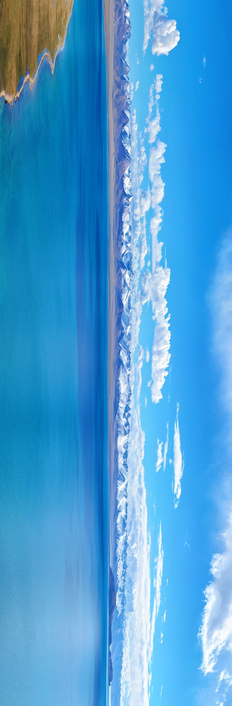

An epic and breathtaking ultra-wide aerial panoramic photograph of a vast, high-altitude lake, viewed from a high angle. The water is a brilliant, crystal-clear turquoise and sapphire blue, stretching across the frame. On one side of the lake, a majestic snow-capped mountain range runs parallel to the shore, their sharp peaks covered in pristine white snow. Between the lake and the mountains lies a flat, barren plain. The sky above is a vibrant, deep blue, filled with scattered, fluffy white cumulus clouds. The entire scene is illuminated by bright, clear natural daylight, creating vivid colors and sharp details. The style should be hyperrealistic and incredibly detailed, reminiscent of professional landscape photography found in National Geographic. Focus on the grand scale, serene atmosphere, and the striking contrast between the blue water, white snow, and blue sky. 8K resolution, high dynamic range (HDR).