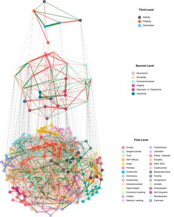
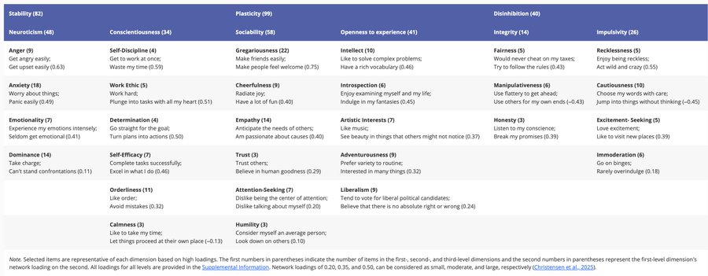

Rethinking Personality: What if the Big Five isn't the full story? Our latest research using Topological Graph Analysis (TGA) has uncovered something remarkable, entirely new personality dimensions that challenge how we understand human traits. While traditional models give us five familiar factors, TGA revealed three novel trait domains: - Sociability - Not just extroversion, but a rich blend of outgoingness, empathy, trust, and social comfort that spans multiple Big Five domains - Integrity - A standalone dimension that emerged independently - Impulsivity - Forming its own distinct trait category Perhaps most intriguing: at the highest level, a meta-trait called "Disinhibition" emerged as an overarching organizational principle. Our result suggests our personality structure may be more nuanced than we thought. Sociability, for instance, combines the best of extroversion AND agreeableness while incorporating reduced self-consciousness. It's a more holistic view of how we connect with others. What excites me most? These findings could reshape how we approach everything from team dynamics to personal development. Sometimes the most important discoveries come from looking at familiar data through an entirely new lens. [#PersonalityPsychology](https://x.com/hashtag/PersonalityPsychology?src=hashtag_click) [#Research](https://x.com/hashtag/Research?src=hashtag_click) [#BigFive](https://x.com/hashtag/BigFive?src=hashtag_click) [#Innovation](https://x.com/hashtag/Innovation?src=hashtag_click) [#PsychScience](https://x.com/hashtag/PsychScience?src=hashtag_click) What personality insights have surprised you the most?
重新思考人格：如果五大特质不能说明全部情况怎么办？ 我们利用拓扑图分析 (TGA) 进行的最新研究发现了一些非凡的、全新的人格维度，这对我们如何理解人类特征提出了挑战。 虽然传统模型给出了五个熟悉的因素，但 TGA 揭示了三个新的特征领域： - 社交能力 - 不仅仅是外向性，而是外向性、同理心、信任和社交舒适度的丰富融合，涵盖多个五大领域 - 完整性 - 独立出现的独立维度 - 冲动 - 形成自己独特的特质类别 也许最有趣的是：在最高层次上，一种被称为“脱抑制”的元特征成为了一种总体组织原则。 我们的结果表明，我们的性格结构可能比我们想象的更加微妙。例如，社交能力兼具外向性和亲和性的优点，同时又不失自我意识。这是一种更全面的视角，可以让我们更好地理解我们如何与他人建立联系。 最让我兴奋的是什么？这些发现可能会重塑我们处理从团队动态到个人发展等所有问题的方式。有时，最重要的发现来自于用全新的视角审视熟悉的数据。 [#人格心理学](https://x.com/hashtag/PersonalityPsychology?src=hashtag_click) [＃研究](https://x.com/hashtag/Research?src=hashtag_click) [#五大](https://x.com/hashtag/BigFive?src=hashtag_click) [＃创新](https://x.com/hashtag/Innovation?src=hashtag_click) [#心理科学](https://x.com/hashtag/PsychScience?src=hashtag_click) 哪些性格见解最令你惊讶？

