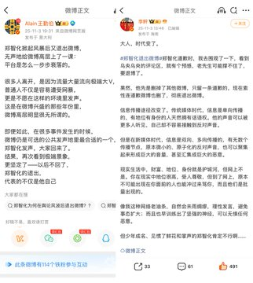
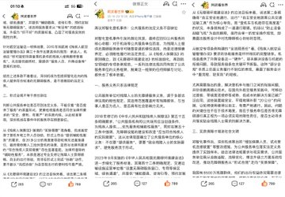

【郑智化事件评论精选】：作家许韬：“郑智化事件是一次严重的舆情失控，代价非常沉重”

成都泌尿科医生“成都下水道”：“深圳机场事件里，那些急着为权力辩护的普通人,可曾想过自己更多时候处在被管理的位置？

中国学者于建嵘：解决登机车与舱门之间的衔接问题, 并非依赖高精尖技术。在国内外航空服务实践中,可移动过渡板、带坡度连接桥等成熟、低成本的解决方案已被广泛应用,这些装置能安全、平稳地填补那“20公分”的间隙,让轮椅使用者得以自主、有尊严地通行。因此,问题的关键往往不在于技术难度,而在于服务单位是否将无障碍通行真正视为一项必须实现的刚性责任,是否主动寻求并落实贴合残障人士需求的解决方案。

作家李鲆：“但是在新媒体时代,信息是双向、多向传播的,有无数个传播节点,原本微小的、原子化的反对声音,也可以聚集起来形成巨大的音量,甚至汇集成巨大的恶意”
 
微博大V“王勤伯”：郑智化退出微博，无声的给微博高层上了一课，平台是怎么一步步衰落的。

