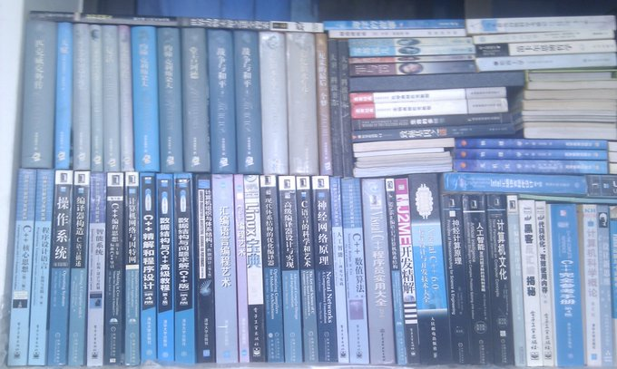

分享我的计算机读书清单

Python: Python 核心编程

系统学习 Python，这一本书足矣，把 Python 的每个细节都讲的很透，每个例子都非常实用。 我学习完这一本书以后，再看任何 Python 库的时候都是翻翻 API 手册， Google 一下就可以快速学会任何 Python 库的用法，并融入到自己的项目中。 

C++: C++完全参考手册

我高三看的一本书，2000 多页，大部头，全英文，但是写的非常好。 这也是我唯一看过的一本 C++的书，只要会这些语法，找个 C++项目， 比如 Qt/C++写一个项目，几乎就知道 C++怎么玩了。 其实 C++还是非常方便的，虽然没有 Python 简洁，但是表现力和库生态都太强大， 不用担心性能问题，大多数讨厌 C++的人， 其实是恐惧自己学不好 C++, 放下恐惧，C++其实很容易学习。 

Java: Java 编程思想

这本书是在书店读完的，写的很不错，但是当时还在读高二，所以已经记不清当初的读后感了， 模糊印象就是一本写的非常通俗易懂的书，讲的非常细节。 

Haskell: Real World Haskell

十年前，#haskell IRC 频道，大多数 Haskeller(科学家，数学家）还在迷恋 Haskell 的数学之美的时候， GHC 黑客 Dons Stewart 写的这本 Real World Haskell 系统型的讲解了 Haskell 应用的各个领域， 从基本语法、函数式编程、科学计算到图形编程等，讲的一针见血， 而且非常薄，学习玩了就可以流畅写程序了。 当然进阶的知识还是要去 #haskell IRC 频道请教数学家们，哈哈哈。  

Elisp: GNU Emacs Lisp Reference Manual

十多年前，我用 Emacs, 对 Elisp 半毛钱不懂，天天就在 EmacsWiki 抄各种配置， 就像一个拾荒者，每天早上起来逛 EmacsWiki, 偶尔碰到高级 Elisp 技巧就把我折腾死了。为了不瞎折腾，我花了一个月的时间读完这本大部头，遇到不懂的 API, 就打开 ielm 临时写一个 demo 函数验证一下，当我读完以后， 我发现 99%的 Emacs 的问题都可以自己调试和解决。 

Ruby: The Ruby Programming Language

学习 Ruby 的时候，已经会了几十门编程语言了，手册从头看一遍，不用写练习基本就可以学会。 因为当你编程语言学得足够多的时候，不同语言的语法都是相同的， 只用学习不同语言之间的微小区别就可以了。 

Vala: Vala Tutorial

Vala 有 C 的速度，Python 的简洁，语法类似 C Sharp, 基本看完这本手册以后，拿着 API 就可以直接开始写了。 Vala 写 Gtk+是非常爽的。 

Rust: Rust 语言圣经

这本书应该是中文范围内将 Rust 最好的一本书， 所有权讲的很清晰， 基本概念的章节都通俗易懂， 进阶章节可以先看一遍， 以后遇到了当工具书来查看。 作者后面讲线程和异步模型时， 理解还是很到位的， 证明作者基本功很扎实， 强烈推荐想学习 Rust 的同学读这本书， 一本就够了。 

正则表达式： 精通正则表达式

这是我唯一看过一本带有　“精通”　名字的书，确实写的非常好， Yahoo 工程师把他平常用到的经验都朴实无华的写出来， 基本学会这本书讲的怎么构建正则表达式的思路，不管是标准的正则表达式， 还是 Perl, Elisp 等其他语言的变种正则，都是触类旁通的。 

代码质量：重构 改善既有代码设计

这本书代码是 java 写的，但并不掩盖它作为重构第一书的地位。 讲解了很多重构小技巧，教你只要养成十来个重构小细节的好习惯， 不论写什么编程语言，局部代码和整体逻辑都干净的像艺术品一般。 这本书的技巧我这十几年都在践行，难得的好书。 

X11: Xlib - C Language X Interface

这本书是读过最枯燥的书籍，但是要从头做一个 Linux 桌面环境，这本书的 API 是必读的。 因为你除了 github 外，根本找不到更多资料来讲解 X11 这个古老的技术了。 

Gtk+: Gtk+ Programming Tutorials

写的最通俗易懂的 Gtk+书籍，学完这本书，直接看 Gtk+ Developer Manual 就可以直接写程序了 

Qt: PyQt5 Totorial

写的最好的 Qt 入门教程，加上 Python 的方便性，非常容易系统学习， 加上学习 Qt 之前已经有 Gtk+五年编程经验，两天看完就直接用 Qt 写程序了。  

Rails: Rails Tutorial

系统的讲解了怎么用 Rails 搭建一个网站，虽然很多架构设计和整体逻辑我是靠 Google 摸索出来的， 但是这本书确是入门不可或缺的，难度适中，学习完了，你对构建网站有一个基本的认识了。 

CSS: CSS 世界

这本书的作者研究了很多年的 CSS，他可以告诉你很多关于浏览器的实现细节以及为什么 CSS 不能工作的原因。 懂了为什么不能工作，剩下的很多事情就能举一反三啦。 但这本书不适合初学 CSS 的朋友读，建议在几个项目中熟练了基本 CSS 技巧以后再来读这本书会更有收获。  

加解密： 图解密码技术

这本书系统地让你学会对称加密、公钥密码、单向散列函数、消息认证码、数字签名、伪随机数生成器等加解密技术背后的原理和细节， 以及这些技术组合而成的安全大厦的框架和应用。 强烈推荐作者 “结城浩” 的其他书籍， 已经看了他写的两本书了， 全书都是图文并茂的讲解复杂技术， 很少有数学公式。

