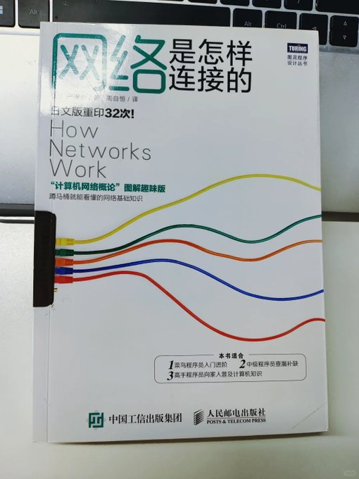

不得不说，日本人在写入门书这块真的太有天赋了。

《网络是怎样连接的》这本书几乎是所有非技术人都能读懂的网络通信入门书。它没有晦涩的术语，也没有一堆让人犯困的公式，而是用日系漫画式图解把“数据从你电脑发出去再回来”的全过程讲得一清二楚。

你能看到一个网页背后发生的所有细节：DNS 查询、IP 地址分配、TCP 握手、数据包传输……原来网络的“神秘世界”其实是一个精密合作的系统。

看完这本书，你不一定成程序员，但一定能明白“上网”这件小事的伟大。
点击评论区阅读👇