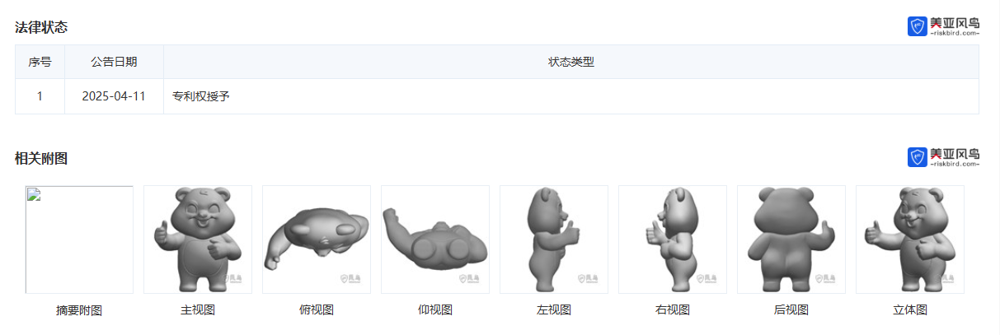
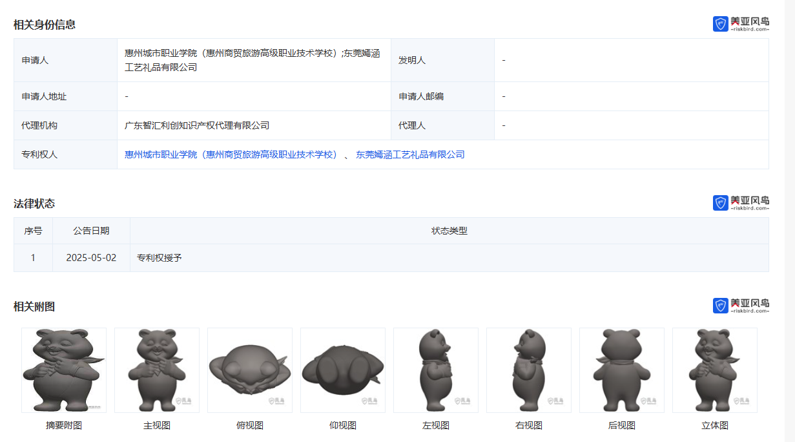

东莞嫣涵工艺礼品有限公司

18578082371
18200767267
0769-83866369
13692894439
18927388558 在用
电话：18823603757

1596350963@qq.com
25963524@qq.com
zhuchunhong_1982@163.com

刘福高
2家>

刘秦汉

杨海艳 (监事) [退出]
朱春红 (经理)
朱春红 (执行董事)

惠州嫣涵科技有限公司

| 
惠州城市职业学院（惠州商贸旅游高级职业技术学校）;东莞嫣涵工艺礼品有限公司 |
| --- |
惠州城市职业学院（惠州商贸旅游高级职业技术学校）、 东莞嫣涵工艺礼品有限公司、 东莞嫣涵工艺礼品有限公司惠州城市职业学院（惠州商贸旅游高级职业技术学校）

杨海艳;王月梅;冯理明;潘宁;杜华英;李春治;李金峰;练晓玲

1.本外观设计产品的名称公仔（熊猫）。2.本外观设计产品的用途用于摆放装饰、娱乐把玩。3.本外观设计产品的设计要点在于形状。4.最能表明设计要点的图片或照片立体图。

1.本外观设计产品的名称公仔（熊猫）。2.本外观设计产品的用途用于摆放装饰、娱乐把玩。3.本外观设计产品的设计要点在于形状。4.最能表明设计要点的图片或照片立体图。

杨海艳;王月梅;冯理明;杜珺;杜华英;韩国新;李春治;李金峰;练晓玲;曲璨
一种计算机视觉防护装置

https://riskbird.com/detail/patent?id=eZRYyQUZhvkN&orderNo=WEB202606271004433068908

