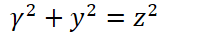

公式
#### 行内公式
这是行内公式`!$ \Gamma(z) = \int_0^\infty t^{z-1}e^{-t}dt\,. $`
#### 块公式
```mathjax!
$$\Gamma(z) = \int_0^\infty t^{z-1}e^{-t}dt\,.$$
```

#### 带编号的公式
`!$\eqref{ref1}$`

```mathjax!
\begin{equation}
\int_0^\infty \frac{x^22}{e^x-1}\,dx = \frac{\pi^4}{15}\label{ref1}
\end{equation}
```
```mathjax!
\begin{equation}

I_{r},d\left( x_{i}y\right) =.\dfrac{Ir\left( x,y\right) }{2\left( 1,y\right) +f^{n}\left( x,y\right) }
\end{equation}
```

```mathjax!
$$
I_{r},d\left( x_{i}y\right) =.\dfrac{Ir\left( x,y\right) }{2\left( 1,y\right) +f^{n}\left( x,y\right) }
$$
```
γ^2+y^2=z^2

y=log_2⁡(x^2+y^2 )

# 公式一

```mathjax!
$$L_d(x, y)=\frac{\log _{10}\left(1+L_v(x, y)\right)}{\log _{10}\left(1+L_{\max }\right)} \cdot \frac{1}{\log _{10}\left(2+8\left(\left(\frac{L_v(x, y)}{L_{\max }}\right)^{\log _{10}(p) / \log _{10}(1 / 2)}\right)\right)} ..$$
```
L_d(x, y)=\frac{\log _{10}\left(1+L_v(x, y)\right)}{\log _{10}\left(1+L_{\max }\right)} \cdot \frac{1}{\log _{10}\left(2+8\left(\left(\frac{L_v(x, y)}{L_{\max }}\right)^{\log _{10}(p) / \log _{10}(1 / 2)}\right)\right)} .
----------


`!$ L_d(x, y)=\frac{\log _{10}\left(1+L_v(x, y)\right)}{\log _{10}\left(1+L_{\max }\right)} \cdot \frac{1}{\log _{10}\left(2+8\left(\left(\frac{L_v(x, y)}{L_{\max }}\right)^{\log _{10}(p) / \log _{10}(1 / 2)}\right)\right)}. $`


by^{i}=j
by^{i}=j

<math xmlns='http://www.w3.org/1998/Math/MathML'> <mi> b </mi> <msup> <mrow> <mi> y </mi> </mrow> <mrow> <mi> i </mi> </mrow> </msup> <mo> = </mo> <mi> j </mi> </math>
by^{i}=j

I_{r},d\left( x_{i}y\right) =.\dfrac{Ir\left( x,y\right) }{2\left( 1,y\right) +f^{n}\left( x,y\right) }

math：
I_{r},d\left( x_{i}y\right) =.\dfrac{Ir\left( x,y\right) }{2\left( 1,y\right) +f^{n}\left( x,y\right) }

I_{r},d\left( x_{i}y\right) =.\dfrac{Ir\left( x,y\right) }{2\left( 1,y\right) +f^{n}\left( x,y\right) }

----------

